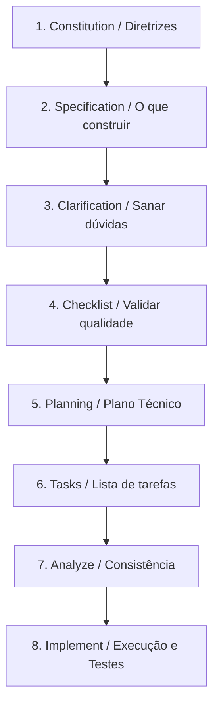

# Spec-Driven Development (SDD) com Spec Kit

Este repositório está configurado para utilizar o **Spec-Driven Development (SDD)** via **Spec Kit** (com base no [speckit.org](https://speckit.org)). Esse processo substitui o desenvolvimento baseado apenas em prompts soltos por um fluxo estruturado e guiado por especificações executáveis como a principal fonte de verdade.

---

## 🚀 Como funciona o fluxo SDD

O fluxo do Spec Kit é composto pelas seguintes fases:



---

## 🛠️ Comandos Disponíveis (Skills)

Como o projeto está integrado com o **Antigravity**, o assistente possui acesso automático às skills localizadas em `.agents/skills/`. Você pode rodar ou pedir para o assistente rodar os seguintes comandos slash:

| Comando | Descrição | Onde é salvo |
| :--- | :--- | :--- |
| `/speckit-constitution` | Cria ou atualiza as diretrizes globais do projeto. | `.specify/memory/constitution.md` |
| `/speckit-specify` | Define os requisitos, cenários e critérios de aceitação da feature. | `specs/<nnn>-<feature-name>/spec.md` |
| `/speckit-clarify` | Identifica áreas ambíguas na especificação e faz perguntas direcionadas para saná-las. | Atualiza a própria especificação. |
| `/speckit-checklist` | Gera e valida um checklist de qualidade para garantir a completude da especificação. | `specs/<nnn>-<feature-name>/checklists/` |
| `/speckit-plan` | Cria o plano de implementação técnica detalhando as alterações de arquivos. | `specs/<nnn>-<feature-name>/plan.md` |
| `/speckit-tasks` | Divide o plano de implementação em tarefas atômicas e ordenadas por dependência. | `specs/<nnn>-<feature-name>/tasks.md` |
| `/speckit-analyze` | Analisa a consistência e cobertura cruzada entre especificação, plano e tarefas. | Relatório de análise. |
| `/speckit-implement` | Executa o desenvolvimento das tarefas gerando código e testes automatizados. | Código do projeto (`app/`, `tests/`, etc.) |

---

## 📦 Instalação da CLI Local

Caso queira gerenciar as extensões e presets do Spec Kit diretamente pela CLI do seu terminal, você pode instalar e rodar a ferramenta:

### Requisitos
- **Python** 3.8+
- **uv** (gerenciador de pacotes rápido do Python)

### Instalação (Recomendado com `uv`)
```bash
uv tool install specify-cli --from git+https://github.com/github/spec-kit.git
```

### Rodar sem instalar (Uma única vez)
```bash
uvx --from git+https://github.com/github/spec-kit.git specify check
```

---

## 📄 Estrutura de Arquivos

A estrutura criada pelo Spec Kit no projeto é:

- **`.specify/`**: Contém configurações, scripts e templates base para specs, planos e tarefas.
- **`.specify/memory/constitution.md`**: As diretrizes principais do projeto (ex: usar convenções do Laravel, TDD, migrações de banco, etc.).
- **`specs/`**: Pasta onde todas as especificações das novas features serão geradas. Cada feature terá sua própria subpasta numerada (ex: `specs/001-user-auth/`).
- **`.agents/skills/`**: As skills de automação que estendem o comportamento do Antigravity no projeto.

---

## 💡 Boas Práticas

1. **Constituição como Lei**: Sempre atualize a Constituição antes de iniciar grandes mudanças arquiteturais.
2. **Especificações Agnósticas de Tecnologia**: Ao usar `/speckit-specify`, descreva **o que** a feature faz e **por que** ela é valiosa para o usuário, não **como** programar.
3. **Passos Sequenciais**: Siga a ordem recomendada para evitar retrabalho ou falhas de implementação.

---

## 🚀 Histórico de Features Implementadas via SDD

### 1. Cascading Project Delete (`specs/001-cascading-project-delete/`)
* **Problema**: A exclusão de um projeto deixava órfãos em diversas tabelas do banco de dados (tarefas, riscos, atas, etc.).
* **Solução**:
  - Implementado o callback do evento `deleting` via método `booted` diretamente no modelo `Project` (`app/Models/Project/Project.php`), que apaga registros em cascata de mais de 35 tabelas relacionadas e tabelas pivô de forma centralizada e segura.
  - Envolvido o método `destroy` no `ProjectController` em uma transação do banco de dados (`DB::transaction`) para assegurar que falhas parciais façam o rollback completo, mantendo a consistência dos dados.
  - Testes unitários e de integração desenvolvidos e validados com sucesso em `tests/Feature/ProjectDeleteTest.php`.
