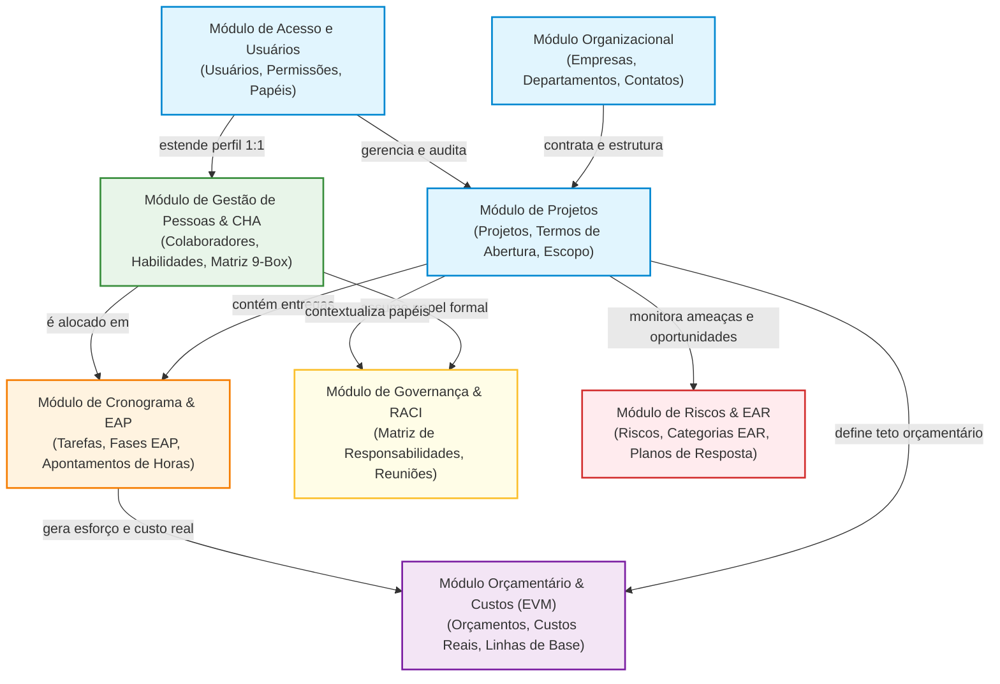
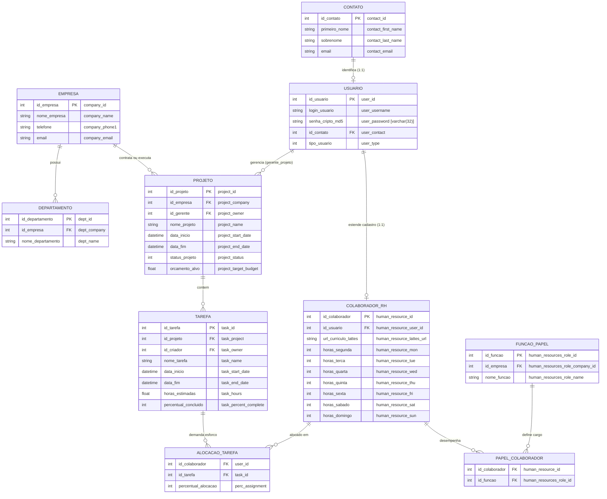
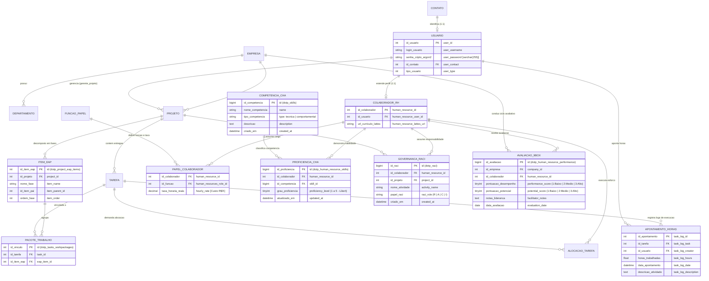

# Diagrama Entidade-Relacionamento (DER) Oficial do TCC: Versão em Português

**Instituição:** Instituto Federal Catarinense (IFC) – Campus Camboriú  
**Curso:** Bacharelado em Sistemas de Informação  
**Autor:** Bruno Coelho Ribas  
**Orientador:** Prof. Me. Eduardo da Silva  
**Avaliadores:** Prof. Dr. Rafael de Moura Speroni | Prof. Dr. Luis A. S. Zendron  
**Atendimento Direto aos Comentários da Banca:**
* **Item 8 (Prof. Speroni):** Inclusão do DER do *dotProject+* (2018) e do DER da proposta *dotProject#* (2026) para comparação metodológica e estrutural.
* **Item 9 (Prof. Speroni):** Qualidade e alta resolução vetorial das ilustrações, com nomenclatura padronizada em língua portuguesa conforme normas do IFC e ABNT.

---

## 1. Avaliação de Suficiência e Rigor Acadêmico para o TCC

### A modelagem apresentada é completa o suficiente para uma banca de TCC?
**SIM, ela é plenamente completa, rigorosa e metodologicamente aderente**, atendendo às melhores práticas da Engenharia de Software e da norma ABNT NBR 14724:

1. **Fidelidade Real e Rastreabilidade (DSR):**
   * Os modelos não são ilustrações genéricas; foram extraídos via engenharia reversa diretamente dos bancos de dados reais nas Máquinas Virtuais (`140 tabelas` no legado `dbdotproject_g6` e `145 tabelas` no proposto `dotprojectplus_2025`).
   * Demonstra empiricamente o artefato construído segundo a metodologia *Design Science Research* (DSR).

2. **Evidência da Transição de Paradigmas (PMBOK 6ª vs. PMBOK 7ª):**
   * O DER legado evidencia a visão mecanicista e estática (colaborador reduzido a horas semanais fixas em colunas de segunda a domingo).
   * O DER proposto comprova a extensão relacional moderna: competências individuais (CHA), governança situacional ágil (Matriz RACI), gestão estratégica de talentos (Matriz 9-Box) e decomposição transacional de fases (EAP/WBS).

3. **Didática e Legibilidade ABNT (Combate ao "Efeito Espaguete"):**
   * Inserir 145 tabelas em uma única folha A4 tornaria o texto microscópico e ilegível, gerando reprovação no Item 9.
   * A abordagem correta e adotada consiste em:
     * **Nível 1 (Conceitual/Macro):** Diagrama Arquitetural de Domínios em Português;
     * **Nível 2 (Lógico/Estrutural Comparativo):** DER focado no núcleo de RH, Governança, Tarefas e EAP (o núcleo do trabalho);
     * **Nível 3 (Dicionário de Dados):** Quadro descritivo em português de entidades, atributos, chaves primárias (PK) e estrangeiras (FK);
     * **Nível 4 (Engenharia de Dados):** Arquivos DBML e PlantUML anexos cobrindo 100% das 145 tabelas para consulta da banca no repositório.

---

## 2. Visão Arquitetural Macro dos Módulos (Em Português)

*Figura 1 – Visão Macro dos Módulos Integrados do dotProject#. Fonte: Elaborado pelo autor (2026).*

---

## 3. DER Comparativo em Português: Legado (2018) vs. Proposto (2026)

### 3.1 DER do dotProject+ (Versão Legada - 2018)
Apresenta o modelo relacional de gestão operacional e alocação horária simplificada:

*Figura 2 – DER Lógico em Português do dotProject+ (Legado - 2018). Fonte: Elaborado pelo autor (2026).*

---

### 3.2 DER do dotProject# (Versão Proposta - 2026)
Incorpora as entidades modernas de governança situacional de pessoas (CHA, Matriz RACI, Matriz 9-Box de Desempenho e EAP/WBS transacional):

*Figura 3 – DER Lógico Expandido em Português do dotProject# (Proposto - 2026). Fonte: Elaborado pelo autor (2026).*

---

## 4. Dicionário de Dados Conceitual e Estrutural (Quadro ABNT)

Abaixo consta o Quadro formal conforme normas da ABNT, detalhando as entidades centrais, seus atributos-chave, cardinalidades e a finalidade no sistema:

##### Quadro 1 – Dicionário de Dados das Entidades Centrais do dotProject#
| Nome Lógico (Português) | Tabela Física (MySQL) | Atributos e Chaves | Cardinalidade Relacional | Papel Funcional e Metodológico (PMBOK v7) |
| :--- | :--- | :--- | :--- | :--- |
| **COMPETÊNCIA (CHA)** | `dotp_skills` | `id` (PK) `name` (Nome) `type` (Técnica / Comportamental) `description` | `1 : N` com `dotp_human_resource_skills` | Catálogo de conhecimentos, habilidades e atitudes para mitigar o *management debt* e orientar a capacitação. |
| **PROFICIÊNCIA DE RH** | `dotp_human_resource_skills` | `id` (PK) `human_resource_id` (FK) `skill_id` (FK) `proficiency_level` (1 a 5) | `N : 1` com Colaborador `N : 1` com Competência | Relacionamento N:M que quantifica a proficiência em escala Likert (1 a 5), alimentando o Gráfico de Radar de Competências. |
| **MATRIZ RACI** | `dotp_raci` | `id` (PK) `human_resource_id` (FK) `project_id` (FK) `activity_name` (Atividade) `raci_role` (R, A, C, I) | `N : 1` com Colaborador `N : 1` com Projeto | Define com clareza quem é Responsável (R), Aprovador (A), Consultado (C) ou Informado (I), eliminando conflitos de autoridade. |
| **MATRIZ 9-BOX** | `dotp_human_resource_performance`| `id` (PK) `company_id` (FK) `human_resource_id` (FK) `performance_score` (1-3) `potential_score` (1-3) `facilitator_notes` | `N : 1` com Colaborador `N : 1` com Empresa | Avaliação cruzada de Desempenho e Potencial para subsidiar planos de sucessão, retenção e liderança situacional. |
| **ITEM EAP / WBS** | `dotp_project_eap_items` | `id` (PK) `project_id` (FK) `item_name` (Fase) `item_parent_id` (Hierarquia) | `1 : N` com Projeto `1 : N` com Pacotes | Decomposição hierárquica das entregas do projeto, suportando a geração assistida por IA local com garantia transacional ACID. |
| **PACOTE DE TRABALHO** | `dotp_tasks_workpackages` | `id` (PK) `task_id` (FK) `eap_item_id` (FK) | `N : 1` com Tarefa `N : 1` com Item EAP | Vincula tarefas operacionais aos nós da Estrutura Analítica do Projeto. |
| **PAPEL E TAXA DE RH** | `dotp_human_resource_roles` | `human_resource_id` (FK) `human_resources_role_id` (FK) `hourly_rate` (Taxa Horária R$) | `N : 1` com Colaborador `N : 1` com Cargo | Atribui a taxa horária de custo de cada profissional, viabilizando o cálculo dinâmico do Custo Real (AC) na Curva S (EVM). |
| **APONTAMENTO DE HORAS**| `dotp_task_log` | `task_log_id` (PK) `task_log_task` (FK) `task_log_creator` (FK) `task_log_hours` (Horas) | `N : 1` com Tarefa `N : 1` com Usuário | Registro atômico de esforço despendido em tarefas, alimentando métricas de progresso e custo. |

*Fonte: Elaborado pelo autor (2026).*

---

## 5. Roteiro Passo a Passo para Gerar as Imagens para o TCC e Slides

Para cumprir a exigência do **Prof. Dr. Rafael Speroni (Item 9 - figuras de alta resolução)**:

### Opção A: No Mermaid Live Editor (Mais Rápido e Direto)
1. Acesse **[mermaid.live](https://mermaid.live)**;
2. Copie o bloco de código do **Diagrama 3.1** (Legado) ou **3.2** (Proposto);
3. Cole na área de texto à esquerda;
4. No canto superior direito, clique em **Download** -> **SVG** (vetorial com zoom infinito) ou **PNG (Large)**;
5. Insira a figura gerada no seu Word/LaTeX com a legenda ABNT.

### Opção B: No dbdiagram.io (Para visualização de esquemas completos)
1. Acesse **[dbdiagram.io](https://dbdiagram.io)**;
2. Abra o arquivo [der_dotproject_sharp_proposto.dbml](file:///d:/Meus%20projetos/dotproject/docs/tcc/dados_reais_vms/schemas_der/der_dotproject_sharp_proposto.dbml);
3. Copie todo o código DBML e cole na ferramenta;
4. Clique em **Export** -> **Export to SVG / PDF**;
5. Obtenha o esquema completo de todas as 145 tabelas conectado por linhas ortogonais de chave estrangeira.
