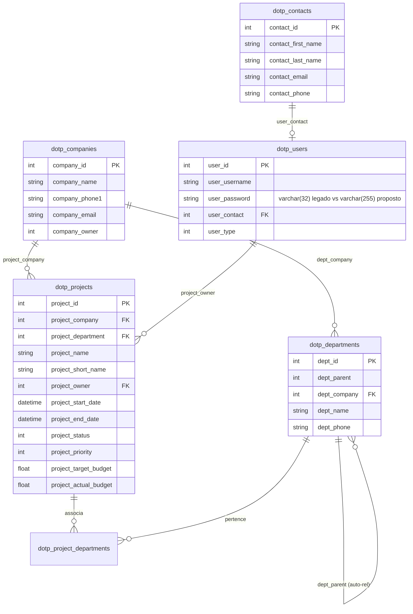
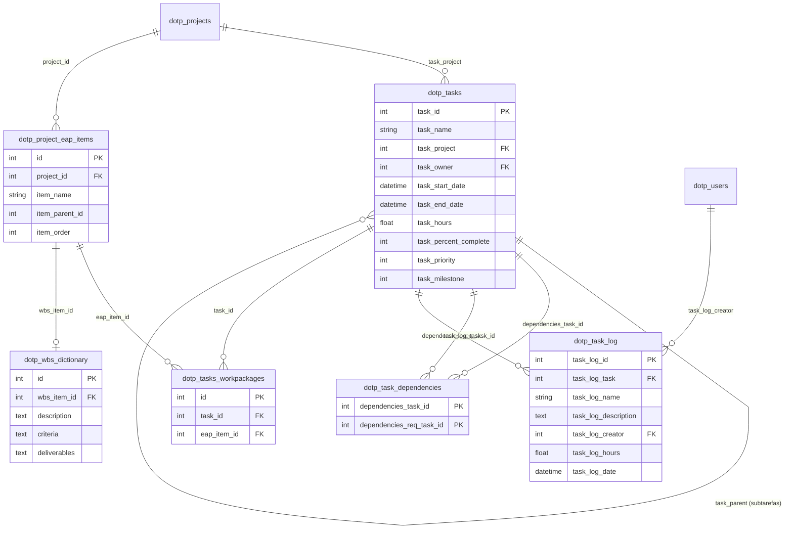
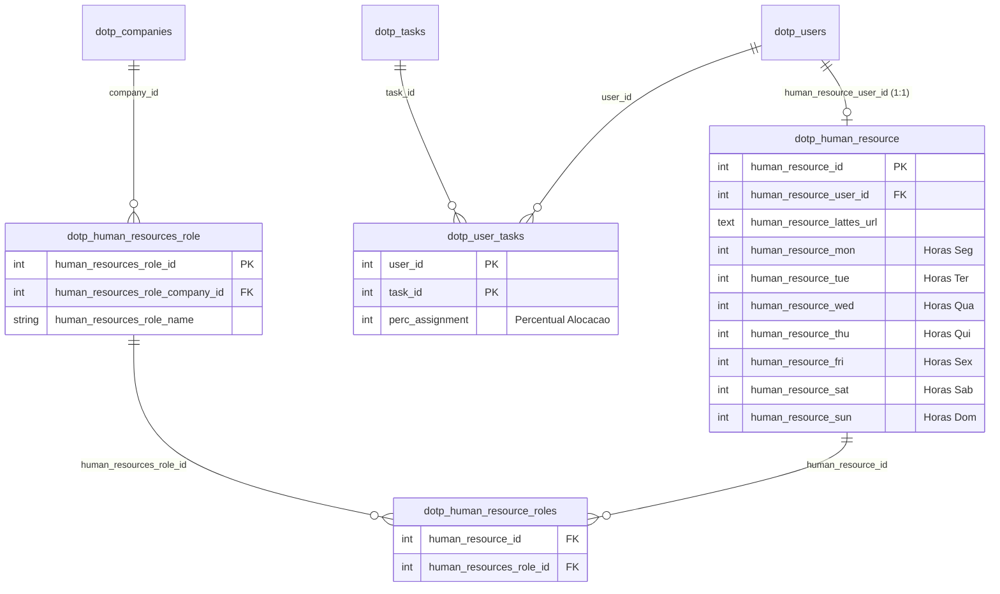
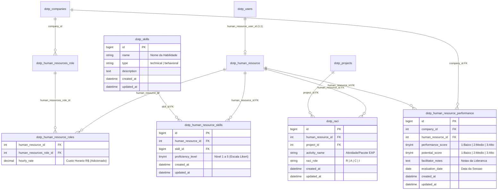
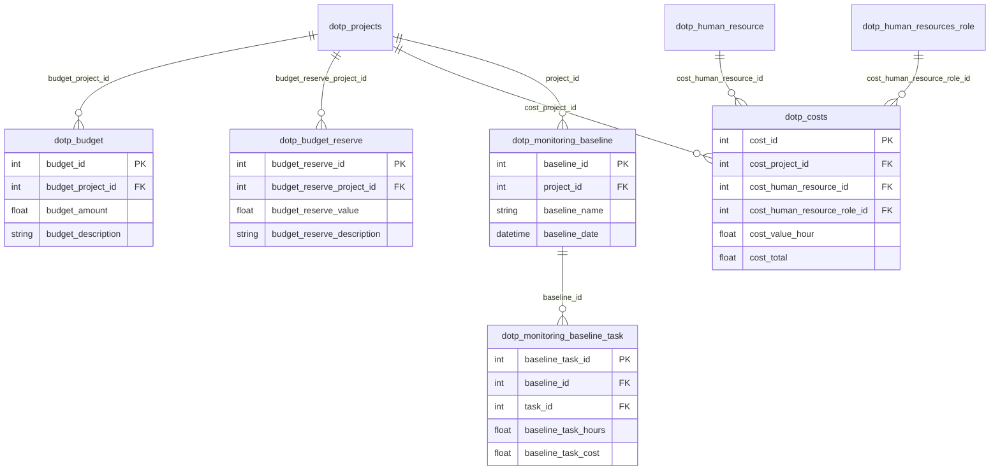
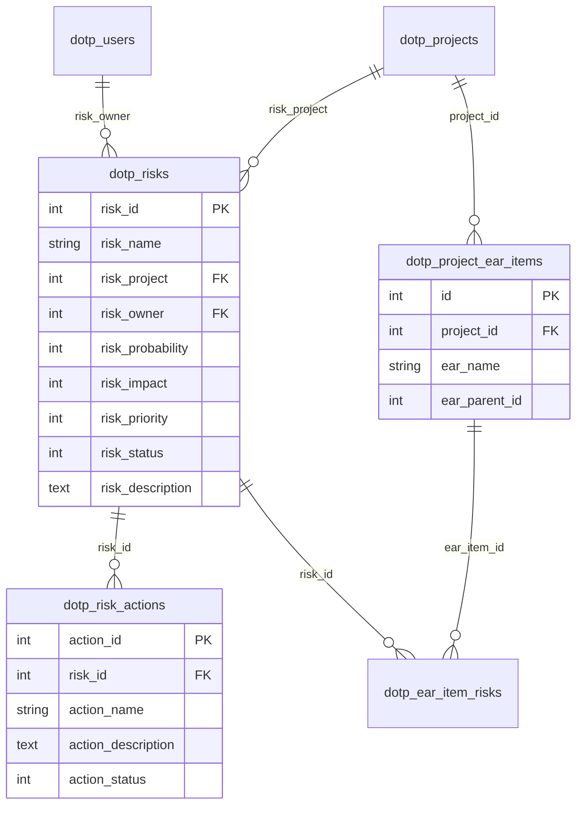
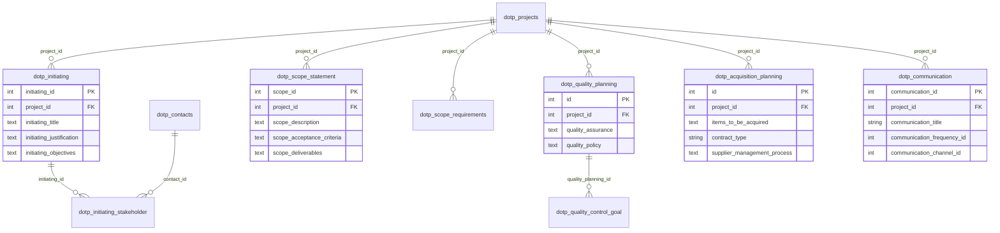

# Diagramas Entidade-Relacionamento (DER) Completos: dotProject+ (2018) vs. dotProject# (2026)

**Projeto:** Modernização do dotProject+ (PHP 5.2 / MyISAM) para dotProject# (PHP 8.4 / Laravel 12 / InnoDB)  
**Instituição:** Instituto Federal Catarinense (IFC) – Campus Camboriú  
**Curso:** Bacharelado em Sistemas de Informação  
**Ambientes de Extração:**
* **dotProject+ (Legado - 2018):** VM `192.168.56.102` | MySQL 5.5 | Base: `dbdotproject_g6` | 140 tabelas | 905 colunas
* **dotProject# (Proposto - 2026):** VM `192.168.56.101` | MySQL 8.0 | Base: `dotprojectplus_2025` | 145 tabelas | 933 colunas

---

## 1. Resumo Executivo e Métricas Comparativas das Bases

A análise estrutural detalhada extraída diretamente dos bancos de dados ativos de ambas as máquinas virtuais revelou a extensão completa da evolução arquitetural:

| Métrica de Banco de Dados | dotProject+ (Legado - VM 102) | dotProject# (Proposto - VM 101) | Variação / Evolução |
| :--- | :--- | :--- | :--- |
| **Total de Tabelas** | 140 tabelas | 145 tabelas | +5 tabelas (+3,6%) |
| **Total de Colunas/Campos** | 905 atributos | 933 atributos | +28 atributos |
| **Chaves Estrangeiras Explícitas (FKs)** | 46 restrições | 52 restrições | +6 restrições formais |
| **Relacionamentos Mapeados (Total)** | 122 relacionamentos | 128 relacionamentos | +6 relacionamentos |
| **Armazenamento de Senhas** | `varchar(32)` (Hash MD5 legado) | `varchar(255)` (Bcrypt / Argon2) | Modernização Criptográfica |
| **Controle de Versão de Esquema** | Scripts `.sql` manuais dispersos | Migrations atômicas do Laravel | Rastreabilidade e Reprodutibilidade |
| **Arquivos DBML e PlantUML Gerados** | `der_dotproject_plus_legado.dbml` | `der_dotproject_sharp_proposto.dbml` | Prontos para [dbdiagram.io](https://dbdiagram.io) |

### Novas Entidades Incorporadas no dotProject#:
1. `dotp_skills`: Catálogo formal de competências técnicas (*hard skills*) e comportamentais (*soft skills*);
2. `dotp_human_resource_skills`: Relação N:M de colaboradores e competências com proficiência Likert de 1 a 5;
3. `dotp_raci`: Matriz de Governança e Responsabilidades RACI (*Responsible, Accountable, Consulted, Informed*);
4. `dotp_human_resource_performance`: Matriz 9-Box de Desempenho e Potencial (notas de 1 a 3, anotações de liderança);
5. `migrations`: Tabela de controle transacional e governança de migrações do framework Laravel.

---

## 2. Visão Macro: Arquitetura Conceitual dos Módulos

```mermaid
graph TD
    classDef core fill:#e1f5fe,stroke:#0288d1,stroke-width:2px;
    classDef rh fill:#e8f5e9,stroke:#388e3c,stroke-width:2px;
    classDef task fill:#fff3e0,stroke:#f57c00,stroke-width:2px;
    classDef cost fill:#f3e5f5,stroke:#7b1fa2,stroke-width:2px;
    classDef risk fill:#ffebee,stroke:#d32f2f,stroke-width:2px;
    classDef aux fill:#f5f5f5,stroke:#616161,stroke-width:1px;

    ORG["Módulo 1: Organização & Empresas<br/>(dotp_companies, dotp_departments)"]:::core
    PROJ["Módulo 1: Projetos & Stakeholders<br/>(dotp_projects, dotp_contacts)"]:::core
    USER["Módulo 1: Usuários & Acessos<br/>(dotp_users, dotp_permissions)"]:::core

    RH["Módulo 3: Recursos Humanos & CHA<br/>(dotp_human_resource, dotp_skills, dotp_raci, dotp_performance)"]:::rh
    TASK["Módulo 2: Tarefas, Cronograma & EAP<br/>(dotp_tasks, dotp_project_eap_items, dotp_task_log)"]:::task
    COST["Módulo 4: Custos & Curva S (EVM)<br/>(dotp_budget, dotp_costs, dotp_monitoring_baseline)"]:::cost
    RISK["Módulo 5: Riscos & EAR<br/>(dotp_risks, dotp_project_ear_items)"]:::risk
    OTHER["Módulo 6: Iniciação, Escopo, Qualidade, Aquisições<br/>(dotp_initiating, dotp_scope, dotp_quality, dotp_acquisition)"]:::aux

    ORG -->|possui departamentos e contrata| PROJ
    USER -->|gerencia e atua| PROJ
    USER -->|estende perfil 1:1| RH
    PROJ -->|contém| TASK
    RH -->|alocado em (dotp_user_tasks)| TASK
    RH -->|papel e responsabilidade| PROJ
    PROJ -->|planeja orçamento e monitora| COST
    TASK -->|aponta horas e custos| COST
    PROJ -->|identifica e trata| RISK
    PROJ -->|formaliza governança| OTHER
```

---

## 3. DERs Lógicos Modulares em Alta Resolução

Devido à grande quantidade de tabelas do sistema (145 tabelas), a visualização acadêmica é dividida pelas principais áreas de conhecimento do PMBOK:

### 3.1 Módulo 1: Núcleo Organizacional (Empresas, Departamentos, Usuários e Projetos)

Este módulo estabelece a fundação da governança e hierarquia de clientes, departamentos internos e projetos.



---

### 3.2 Módulo 2: Tarefas, Cronograma, EAP (WBS) e Apontamentos

Gerenciamento das entregas decompostas do projeto, dependências lógicas (Predecessoras) e apontamento de esforço em tempo real.



---

### 3.3 Módulo 3: Recursos Humanos, Competências CHA, Governança RACI e Matriz 9-Box

Este é o **módulo central do TCC**, onde reside a maior inovação metodológica e estrutural entre as duas versões.

#### 3.3.1 DER do dotProject+ (Legado - 2018)
O modelo legado tratava o colaborador apenas como uma alocação de horas estáticas por dia da semana (`human_resource_mon` a `human_resource_sun`):



#### 3.3.2 DER do dotProject# (Proposto - 2026)
O modelo proposto incorpora a modelagem baseada em competências (CHA), matriz RACI para governança situacional de papéis e a matriz 9-Box para gestão contínua de talentos:



---

### 3.4 Módulo 4: Gestão de Custos, Orçamento e Curva S (EVM)

Controle de orçamentos previstos, reservas de contingência, custos diretos de RH e Linhas de Base (*Baselines*) para o cálculo do Gerenciamento do Valor Agregado (EVM):



---

### 3.5 Módulo 5: Gestão de Riscos e Estrutura Analítica de Riscos (EAR)

Mapeamento de ameaças e oportunidades, probabilidade versus impacto, e decomposição hierárquica por categorias de risco (EAR):



---

### 3.6 Módulo 6: Iniciação (TAP), Escopo, Qualidade, Aquisições e Comunicações

Integração dos artefatos essenciais que formalizam a governança do projeto segundo o PMBOK:



---

## 4. Arquivos de Engenharia de Dados Gerados para o TCC

Para utilização em bancas, relatórios em LaTeX e ferramentas de modelagem visual em altíssima definição, foram gerados os seguintes arquivos complementares:

1. **`der_dotproject_plus_legado.dbml`** (52 KB):
   * Especificação DBML completa de todas as **140 tabelas** e **122 relacionamentos** do dotProject+ (2018).
   * Importável diretamente no [dbdiagram.io](https://dbdiagram.io) para geração de diagramas vetoriais (SVG/PDF).

2. **`der_dotproject_sharp_proposto.dbml`** (54 KB):
   * Especificação DBML completa de todas as **145 tabelas** e **128 relacionamentos** do dotProject# (2026).
   * Contém as entidades `dotp_skills`, `dotp_human_resource_skills`, `dotp_raci`, `dotp_human_resource_performance` e `migrations`.

3. **`der_dotproject_plus_legado.puml`** e **`der_dotproject_sharp_proposto.puml`**:
   * Arquivos PlantUML completos para renderização estática ou integração em documentações acadêmicas.

4. **TSVs Brutos de Metadados**:
   * `vm1_tables.tsv`, `vm1_columns.tsv`, `vm1_fks.tsv`
   * `vm2_tables.tsv`, `vm2_columns.tsv`, `vm2_fks.tsv`

---

## 5. Como Gerar as Figuras em Alta Resolução (Atendendo ao Comentário 9 da Banca)

Para garantir que a banca avaliadora (Prof. Dr. Rafael de Moura Speroni) disponha de figuras nítidas e legíveis no relatório:

1. Acesse **[dbdiagram.io](https://dbdiagram.io)**;
2. Abra o arquivo [der_dotproject_sharp_proposto.dbml](file:///d:/Meus%20projetos/dotproject/docs/tcc/dados_reais_vms/schemas_der/der_dotproject_sharp_proposto.dbml) e cole seu conteúdo no editor;
3. O software renderizará instantaneamente todas as tabelas conectadas pelas linhas de chave estrangeira;
4. Clique em **Export** -> **Export to SVG / PNG (High Quality)**;
5. Repita o processo com o arquivo [der_dotproject_plus_legado.dbml](file:///d:/Meus%20projetos/dotproject/docs/tcc/dados_reais_vms/schemas_der/der_dotproject_plus_legado.dbml);
6. Insira as imagens vetoriais no capítulo de resultados e anexos do TCC.
