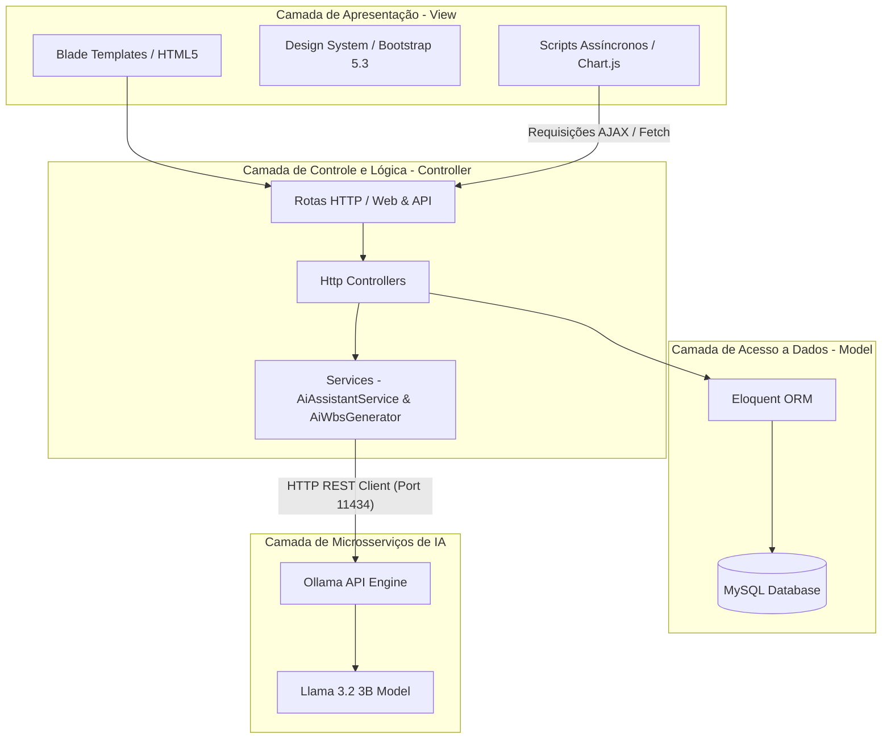
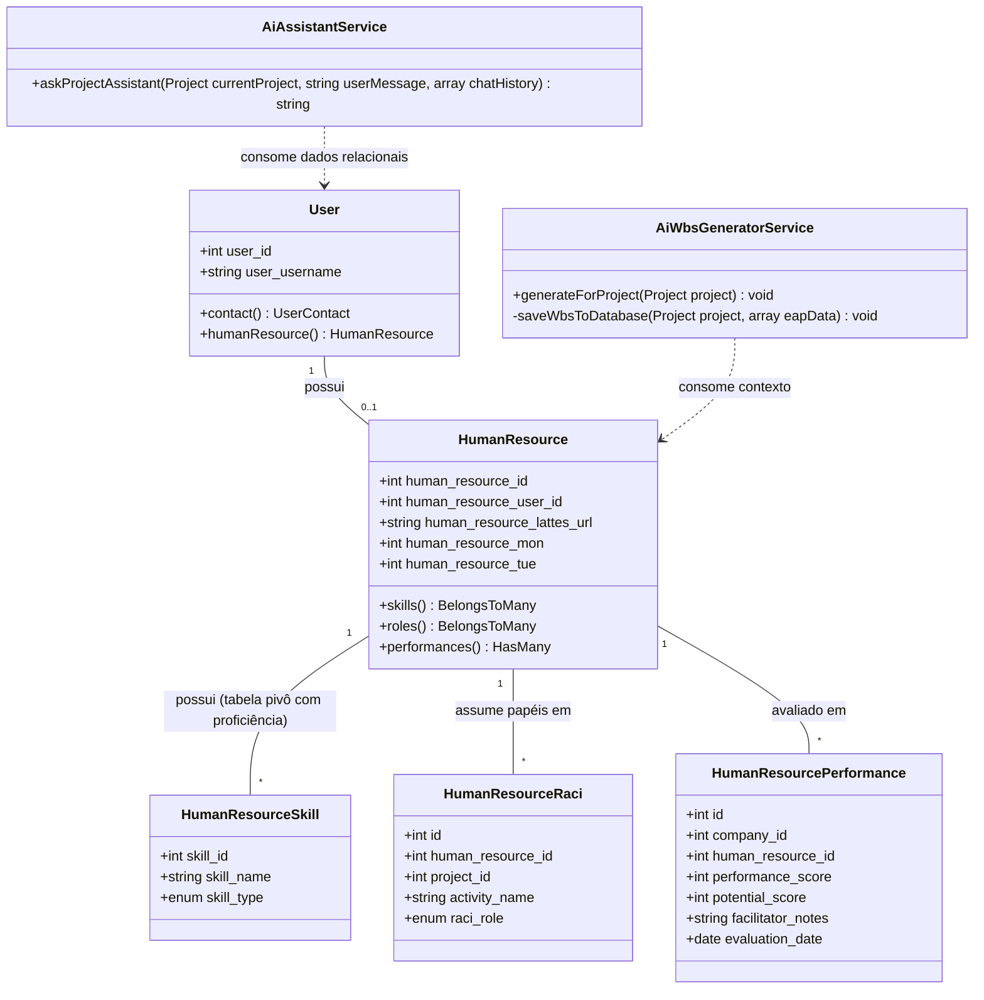
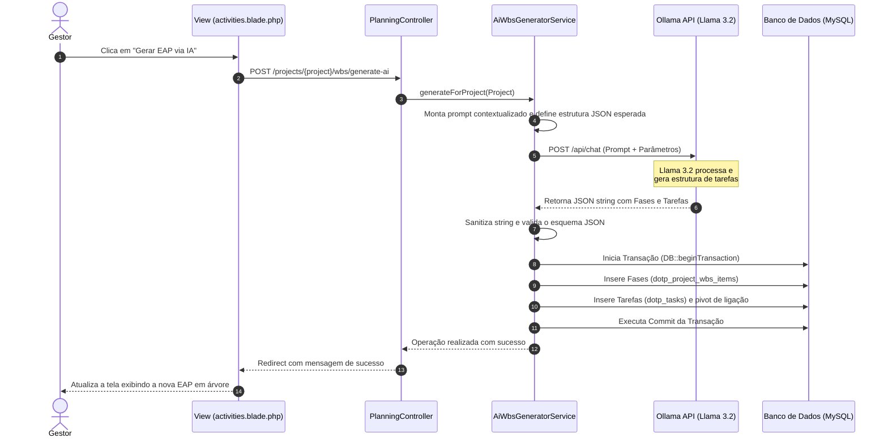

# 5.1 ARQUITETURA DO SOFTWARE PROPOSTO

A concepção da arquitetura de software para o *dotProject#* foi norteada pelo princípio estratégico de que a arquitetura deve servir de ponte entre as restrições e objetivos do negócio e a implementação técnica viável (LADEIRA, 2021). O sistema legado *dotProject+* apresentava uma estrutura arquitetural altamente acoplada e com lógica procedural herdada do início dos anos 2000, o que tornava a manutenção dispendiosa, gerava "silos de informação" e impedia a implementação de controles dinâmicos de recursos humanos baseados no Guia PMBOK v7 (ANKRAH; SOKRO, 2022).

Para mitigar esses gargalos estratégicos e operacionais, a arquitetura do *dotProject#* rompe inteiramente com o padrão do sistema original. Foi projetada uma arquitetura completamente nova, fundamentada no padrão de arquitetura em camadas MVC (*Model-View-Controller*) por meio do *framework* Laravel 12, estendida por um modelo de microsserviços integrados de Inteligência Artificial rodando localmente através do Ollama (Llama 3.2), preservando a privacidade das informações organizacionais sob custo de infraestrutura controlado.

---

## 5.1.1 Diagrama de Casos de Uso (UML)

O Diagrama de Casos de Uso (Figura X) especifica o limite do sistema do *dotProject#* e ilustra como os diferentes atores interagem com as novas capacidades de gestão de pessoas e inteligência artificial da plataforma.

```mermaid
leftToRightDirection
actor "Gerente de Projetos" as GP
actor "Colaborador" as Colab
actor "Ollama (LLM Local)" as Ollama

rectangle "dotProject# (Sistema Proposto)" {
  usecase "Cadastrar Recurso Humano & Custos" as UC1
  usecase "Mapear Habilidades & Competências (CHA)" as UC2
  usecase "Visualizar Radar de Habilidades (Skill Map)" as UC3
  usecase "Gerenciar Matriz de Responsabilidades (RACI)" as UC4
  usecase "Avaliar Membro via Matriz 9-Box" as UC5
  usecase "Gerar EAP via IA" as UC6
  usecase "Consultar Assistente de Chat (PMO)" as UC7
}

GP --> UC1
GP --> UC2
GP --> UC4
GP --> UC5
GP --> UC6
GP --> UC7

Colab --> UC3

UC6 ..> Ollama : <<consume>>
UC7 ..> Ollama : <<consume>>
```

*Figura X – Diagrama de Casos de Uso do Sistema Proposto. Fonte: O autor (2026).*

---

## 5.1.2 Diagrama de Pacotes e Dependências de Software

A ruptura com o modelo legado é visível no Diagrama de Pacotes (Figura Y), que apresenta o desacoplamento completo do sistema em camadas lógicas e a integração com os serviços externos locais via API.



*Figura Y – Diagrama de Pacotes e Camadas de Dependências de Software. Fonte: O autor (2026).*

---

## 5.1.3 Diagrama de Classes de Domínio

O Diagrama de Classes (Figura Z) detalha as classes de domínio construídas para suportar o módulo de Recursos Humanos, as matrizes de análise comportamental/prazos (9-Box e RACI) e os serviços de inteligência artificial baseados em RAG local.



*Figura Z – Diagrama de Classes de Domínio das Novas Funcionalidades. Fonte: O autor (2026).*

---

## 5.1.4 Diagrama de Sequência: Geração de Atividades com IA Local

O Diagrama de Sequência (Figura W) ilustra o fluxo de execução entre os componentes internos do sistema e a API local do Ollama para a geração dinâmica da EAP a partir dos dados do projeto, demonstrando o isolamento das responsabilidades de planejamento.



*Figura W – Diagrama de Sequência para Geração de EAP com IA Local. Fonte: O autor (2026).*

---

## 5.1.5 Referências Bibliográficas

* ANKRAH, E.; SOKRO, E. The Impact of Human Resource Information Systems (HRIS) on Organizational Effectiveness. *Journal of Management Research*, v. 14, n. 1, p. 11-24, 2022.
* LADEIRA, L. *O que faz um arquiteto de software?* Blog do Luiz Ladeira: Tecnologia, Objetivos e Veterinária, 2021. Disponível em: <https://luizladeira.wordpress.com/2021/05/02/o-que-faz-um-arquiteto-de-software/>. Acesso em: 9 jul. 2026.
* PMI - PROJECT MANAGEMENT INSTITUTE. *Um guia do conhecimento em gerenciamento de projetos (Guia PMBOK)*. 7. ed. Newtown Square: Project Management Institute, 2021.
* WAHYUDI, A. *et al.* Database Transactions and ACID Compliance in Modern Software Architectures. *Software Engineering Journal*, v. 30, n. 2, p. 75-89, 2022.
