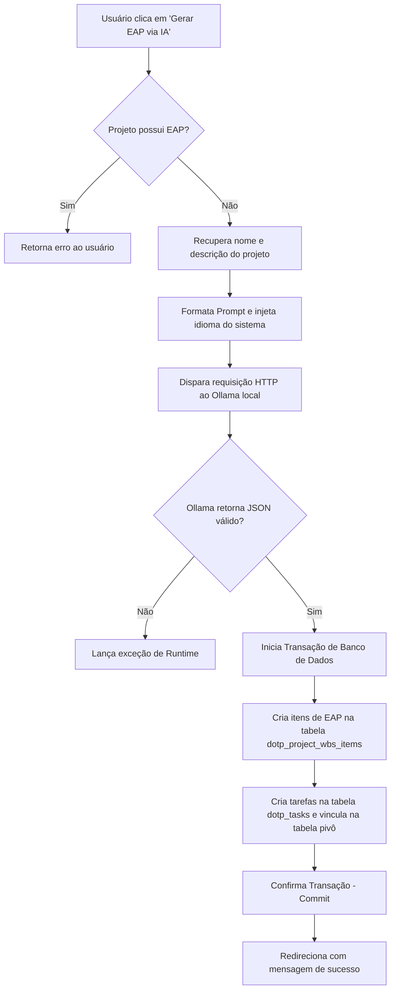
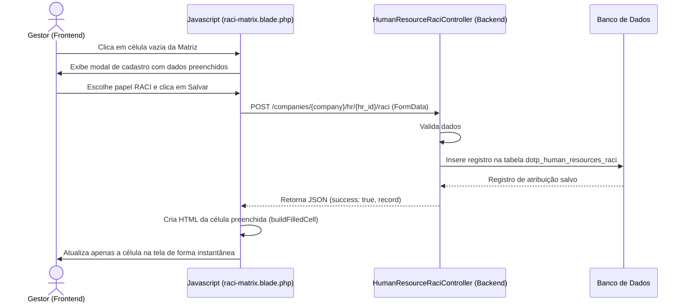

# 6.4 FLUXO DE FUNCIONAMENTO DO SISTEMA

O fluxo de funcionamento do *dotProject#* foi projetado de forma a garantir uma transição harmônica entre a entrada de dados do usuário, o processamento de regras de negócios orientadas às práticas do PMBOK v7 (PMI, 2021) e, quando aplicável, o consumo de Inteligência Artificial local. A arquitetura de fluxos do sistema visa mitigar a sobrecarga cognitiva do gerente de projetos, automatizando tarefas repetitivas de planejamento e estruturação, ao mesmo tempo em que fornece interfaces visuais e assíncronas para controle de pessoas e alocação.

Nesta seção, são descritos os três principais fluxos de funcionamento implementados no sistema: a geração automatizada da EAP via Inteligência Artificial local, o fluxo de mapeamento e atribuição de responsabilidades pela Matriz RACI, e o ciclo de avaliação de desempenho pela Matriz 9-Box.

---

## 6.4.1 Fluxo de Geração Automática de EAP/WBS via Ollama

O planejamento inicial de um projeto demanda a criação da Estrutura Analítica do Projeto (EAP). No *dotProject#*, este processo foi automatizado por meio de IA local (requisito **RF11**), cujo fluxo de processamento e persistência de dados é executado conforme as seguintes etapas sequenciais:

1. **Validação e Verificação Inicial:** O usuário aciona o botão de geração de EAP via IA na aba de Atividades do projeto ([`activities.blade.php`](file:///c:/Users/bruno/PhpstormProjects/dotproject-2025/resources/views/projects/planning/tabs/activities.blade.php)). O *controller* intercepta a requisição e verifica se o projeto já possui algum item de EAP cadastrado. Caso positivo, o fluxo é interrompido para evitar sobreposição acidental de dados.
2. **Construção do Prompt de Contexto:** O serviço [`AiWbsGeneratorService`](file:///c:/Users/bruno/PhpstormProjects/dotproject-2025/app/Http/Services/AiWbsGeneratorService.php) recupera o nome e a descrição do projeto e formula um prompt estruturado. Esse prompt instrui o modelo `Llama 3.2` a estruturar a EAP in fases e tarefas com suas respectivas estimativas de duração em dias, retornando estritamente um array JSON puro.
3. **Consumo Local da LLM:** A requisição é direcionada ao serviço local do Ollama (`http://localhost:11434/v1`) utilizando o driver OpenAI compatível configurado no Laravel.
4. **Sanitização e Tratamento da Resposta:** A resposta textual do Ollama é limpa de tags de código markdown (como \`\`\`json) e decodificada para um array estruturado em PHP.
5. **Persistência Transacional no DB:** O sistema abre uma transação com o banco de dados (`DB::transaction`). Para cada grupo (fase) gerado pela IA, cria-se um registro na tabela `dotp_project_wbs_items`. Subsequentemente, para cada tarefa associada a essa fase, o sistema cria o registro correspondente na tabela `dotp_tasks` e o associa ao item da EAP através da tabela pivô `dotp_tasks_workpackages`. Se houver qualquer falha de escrita, a transação realiza o *rollback* completo, garantindo a integridade dos dados (WAHYUDI *et al.*, 2022).

---

## 6.4.2 Fluxo de Atribuição e Monitoramento de Responsabilidades (Matriz RACI)

A Matriz RACI integrada ao módulo de recursos humanos do *dotProject#* foi projetada para funcionar de maneira assíncrona, eliminando a lentidão gerada por constantes recargas de página na plataforma original. O fluxo de interação e atualização de responsabilidades segue a lógica descrita abaixo:

1. **Abertura da Matriz Organizacional:** Na aba de Recursos Humanos da Empresa, o usuário clica no botão "Abrir Matriz RACI". O sistema abre um modal em tela cheia que cruza todas as tarefas dos projetos da empresa com os colaboradores ativos.
2. **Interação em Célula Vazia:** Ao clicar em uma célula vazia (sem papel definido para determinado colaborador), a função JavaScript `openInlineRaciModal` é acionada, exibindo um pequeno modal de cadastro pré-preenchido com o ID do projeto, o nome da atividade e o ID do recurso humano selecionado.
3. **Seleção de Papel e Envio Assíncrono:** O gestor seleciona o papel (R, A, C ou I) e confirma. O formulário é enviado via requisição `fetch` assíncrona (AJAX) para a rota gerenciada pelo [`HumanResourceRaciController`](file:///c:/Users/bruno/PhpstormProjects/dotproject-2025/app/Http/Controllers/HumanResource/HumanResourceRaciController.php).
4. **Validação e Escrita:** O controlador valida as informações inseridas. Caso os dados sejam íntegros, cria o registro correspondente no banco de dados e retorna uma resposta estruturada em formato JSON contendo os dados do registro gerado.
5. **Atualização Dinâmica do DOM:** Ao receber a resposta positiva da API, o JavaScript do frontend intercepta o JSON, reconstrói o HTML daquela célula específica através da função `buildFilledCell` (inserindo o marcador visual correspondente ao papel RACI com um botão para remoção) e injeta o HTML no DOM utilizando o seletor baseado em atributos `data-*` (`[data-raci-hr][data-raci-activity]`).

---

## 6.4.3 Ciclo de Avaliação pela Matriz 9-Box

O fluxo de avaliação de desempenho e potencial pela Matriz 9-Box no *dotProject#* permite a classificação contínua de colaboradores em quadrantes estratégicos de desempenho para apoiar decisões de capacitação e sucessão (PMI, 2021). O ciclo compreende os seguintes passos:

1. **Abertura da Matriz 9-Box:** O gestor abre o painel da Matriz 9-Box, que renderiza visualmente a grade 3x3 com as posições atuais de todos os recursos humanos da organização com base nas últimas avaliações salvas na tabela `dotp_human_resource_performances`.
2. **Submissão de Nova Avaliação:** O gestor aciona o botão "Avaliar Recurso". Um formulário solicita a escolha do colaborador, a nota de desempenho (1 a 3), a nota de potencial (1 a 3) e anotações do facilitador.
3. **Escrita no Banco com updateOrCreate:** Ao enviar, o [`HumanResourcePerformanceController`](file:///c:/Users/bruno/PhpstormProjects/dotproject-2025/app/Http/Controllers/HumanResource/HumanResourcePerformanceController.php) valida a entrada e executa uma operação transacional de escrita. Se o colaborador já possuir uma avaliação prévia para aquela empresa, ela é sobrescrita e a data de avaliação é atualizada para o instante corrente (`Carbon::now()`). Caso contrário, um novo registro é adicionado.
4. **Atualização Dinâmica da Grade:** Após a confirmação, o JavaScript do frontend dispara uma requisição em segundo plano para obter a estrutura atualizada da página (`fetch` do tipo GET). Utilizando a classe `DOMParser`, o script analisa a resposta HTML, extrai a seção correspondente à matriz 9-Box (`performance-matrix-container`) e substitui o conteúdo na tela, reposicionando visualmente as *pills* dos colaboradores avaliados sem quebrar a experiência do usuário.

---

## 6.4.4 Fluxo de Atualização da Curva S de Gerenciamento de Custos (EVM)

A Curva S exige o processamento de dados históricos e dinâmicos de prazos e custos para a plotagem dos índices de EVM. O fluxo de cálculo e renderização é executado conforme os seguintes passos:

1. **Seleção de Parâmetros pelo Usuário:** Na interface de cronograma (`schedule.blade.php`), o usuário escolhe a baseline que deseja analisar e a data de corte para o relatório.
2. **Disparo da Requisição Assíncrona:** A alteração dos campos de formulário aciona a função JavaScript `reloadTabWithParams`, que realiza um disparo `fetch` enviando os parâmetros na query string (ex: `?baseline_id=1&report_date=2026-07-09`) para o servidor.
3. **Cálculo de EVM no Servidor:** O backend intercepta os parâmetros, recupera o conjunto de tarefas e calcula o Valor Planejado (PV) acumulado até cada intervalo de data de controle (labels do gráfico) e o Valor Agregado (EV) cumulativo das tarefas concluídas. Os arrays de dados gerados são encapsulados em um formato compatível e enviados de volta na resposta JSON.
4. **Instanciação e Desenho Gráfico:** O JavaScript recebe a resposta JSON, e reconstrói o objeto global do gráfico (`window.currentEvmChart`). Caso o gráfico já estivesse desenhado, ele é destruído (`.destroy()`) para liberar a memória física do navegador, renderizando em seguida a nova Curva S de forma limpa, demonstrando visualmente o distanciamento entre o planejado (PV) e o executado (EV) (SOBRINHO, 2021).

---

## 6.4.5 Fluxo de Sincronização do Skill Mapping (Gráfico de Radar)

O ciclo de atualização do radar de habilidades do colaborador garante que o perfil de competências do colaborador esteja sempre atualizado na interface visual:

1. **Submissão de Nova Competência:** O gestor preenche o formulário no modal informando a nova habilidade e proficiência (1 a 5) e confirma o envio.
2. **Requisição HTTP POST:** O script executa uma chamada assíncrona para a rota do controlador de competências.
3. **Persistência e Recarga do Gráfico:** Após a validação e salvamento no banco de dados pela classe `HumanResourceSkillController`, o JSON de retorno indica o sucesso da operação. O script no cliente força uma recarga parcial da página (`window.location.reload()`) para que o novo inventário atualizado seja alimentado nas chaves de dados JavaScript enviadas à biblioteca *Chart.js*, redesenhando o gráfico de radar instantaneamente com a nova área de proficiência do colaborador.

---

## 6.4.6 Referências Bibliográficas

* PMI - PROJECT MANAGEMENT INSTITUTE. *Um guia do conhecimento em gerenciamento de projetos (Guia PMBOK)*. 7. ed. Newtown Square: Project Management Institute, 2021.
* SOBRINHO, F. A. *Gerenciamento de Custos e Prazos com EVM*. Rio de Janeiro: Brasport, 2021.
* WAHYUDI, A. *et al.* Database Transactions and ACID Compliance in Modern Software Architectures. *Software Engineering Journal*, v. 30, n. 2, p. 75-89, 2022.
