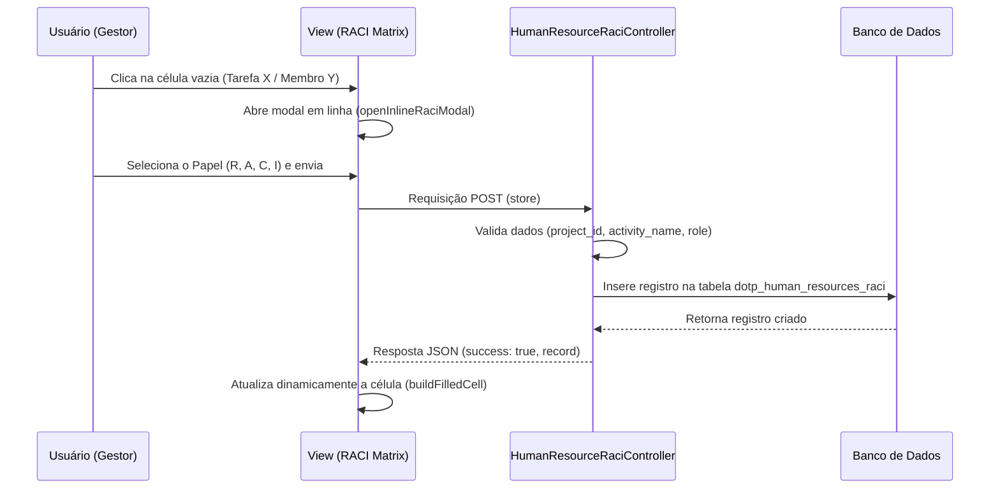
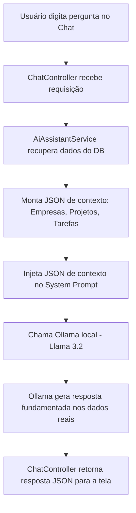

# 6.3 FUNCIONALIDADES IMPLEMENTADAS

A modernização e ampliação da ferramenta *dotProject+*, originando a versão aprimorada denominada *dotProject#*, contemplou a especificação e codificação de novos módulos focados no gerenciamento estratégico de pessoas e na introdução de Inteligência Artificial local para otimização do planejamento. De acordo com as diretrizes do Guia PMBOK v7 (PMI, 2021), as pessoas constituem o elemento central para a entrega de valor em projetos. Desse modo, o desenvolvimento focou em transcender o aspecto puramente operacional de controle de horas e alocação estática de tarefas, fornecendo aos gestores ferramentas analíticas para a governança do capital humano (ANKRAH; SOKRO, 2022).

Nesta seção, são descritas em detalhe as funcionalidades construídas no *dotProject#*, organizadas por módulo técnico e correlacionadas às suas respectivas implementações de código no ecossistema do *framework* Laravel 12 e banco de dados MySQL.

Para guiar a leitura e estabelecer a rastreabilidade do projeto, o Quadro 7 sintetiza a correlação entre os requisitos funcionais especificados e os módulos efetivamente desenvolvidos.

##### Quadro 7 – Rastreabilidade entre Requisitos Funcionais e Módulos Implementados
| Código do Requisito | Descrição Curta do Requisito | Funcionalidade Correspondente | Arquivos Principais de Implementação |
| :--- | :--- | :--- | :--- |
| **RF01** | Cadastro de competências por membro. | Inventário de Competências (CHA). | [`HumanResourceSkillController.php`](file:///c:/Users/bruno/PhpstormProjects/dotproject-2025/app/Http/Controllers/HumanResource/HumanResourceSkillController.php) |
| **RF04** | Visualização de relatórios de desempenho. | Matriz 9-Box e Skill Mapping. | [`HumanResourcePerformanceController.php`](file:///c:/Users/bruno/PhpstormProjects/dotproject-2025/app/Http/Controllers/HumanResource/HumanResourcePerformanceController.php), [`show.blade.php`](file:///c:/Users/bruno/PhpstormProjects/dotproject-2025/resources/views/companies/human-resources/show.blade.php) |
| **RF08** | Alocação de recursos e custos a tarefas. | Matriz RACI e Curva S de Custos. | [`HumanResourceRaciController.php`](file:///c:/Users/bruno/PhpstormProjects/dotproject-2025/app/Http/Controllers/HumanResource/HumanResourceRaciController.php), [`CostController.php`](file:///c:/Users/bruno/PhpstormProjects/dotproject-2025/app/Http/Controllers/Cost/CostController.php), [`costs/index.blade.php`](file:///c:/Users/bruno/PhpstormProjects/dotproject-2025/resources/views/costs/index.blade.php) |
| **RF11** | Geração automática de EAP via IA. | Planejador EAP (Ollama / Llama 3.2). | [`AiWbsGeneratorService.php`](file:///c:/Users/bruno/PhpstormProjects/dotproject-2025/app/Http/Services/AiWbsGeneratorService.php), [`PlanningController.php`](file:///c:/Users/bruno/PhpstormProjects/dotproject-2025/app/Http/Controllers/Planning/PlanningController.php) |
| **RF12** | Assistente de chat integrado. | PMO Virtual (LLM RAG local). | [`ChatController.php`](file:///c:/Users/bruno/PhpstormProjects/dotproject-2025/app/Http/Controllers/ChatController.php), [`AiAssistantService.php`](file:///c:/Users/bruno/PhpstormProjects/dotproject-2025/app/Http/Services/AiAssistantService.php) |

*Fonte: elaborado pelo autor (2026).*

---

## 6.3.1 Mapeamento e Inventário de Competências (Mapeamento CHA)

Em conformidade com o requisito funcional **RF01**, o sistema passou a permitir o mapeamento detalhado das competências e habilidades técnicas e comportamentais dos colaboradores, promovendo uma transição de modelos de alocação baseados em cargos estáticos para abordagens dinâmicas orientadas a habilidades (*skills-based*) (POYNTON *et al.*, 2023).

* **Interface de Cadastro e Gerenciamento:** Foi desenvolvida uma interface integrada à visualização de detalhes do recurso humano, na qual é possível cadastrar novas competências associadas a cada colaborador. Para cada competência cadastrada, o gestor define o nome da habilidade, sua classificação e o nível de proficiência.
* **Modelo e Regra de Negócio:** No *backend*, a lógica foi concentrada na classe [`HumanResourceSkillController`](file:///c:/Users/bruno/PhpstormProjects/dotproject-2025/app/Http/Controllers/HumanResource/HumanResourceSkillController.php). Ao armazenar uma competência, o método `store` efetua a validação dos parâmetros de entrada (`skill_name`, `skill_type` e `proficiency_level`).
* **Estrutura Relacional (Muitos para Muitos):** Utilizando os recursos do Eloquent ORM, o relacionamento entre o modelo de Recursos Humanos e as Competências é estabelecido por meio de uma tabela intermediária (tabela pivô), registrando a proficiência diretamente no relacionamento através do método `syncWithoutDetaching`, o qual preserva registros pré-existentes e atualiza apenas a relação específica.

```php
// Trecho de persistência de competência em HumanResourceSkillController
$skill = HumanResourceSkill::query()->firstOrCreate(
    ['skill_name' => $request->skill_name],
    ['skill_type' => $request->skill_type]
);

$hr = HumanResource::findOrFail($hrId);
$hr->skills()->syncWithoutDetaching([
    $skill->skill_id => ['proficiency_level' => $request->proficiency_level]
]);
```

---

## 6.3.2 Matriz de Responsabilidades (Matriz RACI)

A falta de clareza na atribuição de papéis em projetos frequentemente gera retrabalho e sobreposições de atribuições, resultando no surgimento de "silos de informação" e gargalos operacionais (ANKRAH; SOKRO, 2022). Alinhado ao requisito funcional **RF08**, desenvolveu-se o módulo da **Matriz RACI** (*Responsible, Accountable, Consulted, Informed*) integrada aos recursos humanos e projetos cadastrados na mesma organização.

* **Painel Dinâmico e Iterativo:** Implementado na *view* [`raci-matrix.blade.php`](file:///c:/Users/bruno/PhpstormProjects/dotproject-2025/resources/views/companies/human-resources/raci-matrix.blade.php), o painel renderiza uma tabela cruzando as tarefas de cada projeto nas linhas com os membros cadastrados nas colunas. Cada interseção apresenta o papel do colaborador para aquela atividade específica, representado por marcadores visuais coloridos e letras indicativas (R, A, C ou I).
* **Controlador e Persistência:** A classe [`HumanResourceRaciController`](file:///c:/Users/bruno/PhpstormProjects/dotproject-2025/app/Http/Controllers/HumanResource/HumanResourceRaciController.php) gerencia as operações da matriz. O método `store` valida se o papel selecionado pertence ao conjunto restrito de opções permitidas e salva a associação no banco de dados.
* **Componentização Dinâmica e UX:** A interface foi concebida para permitir a adição rápida de papéis sem a necessidade de recarga completa da página. Ao clicar em uma célula vazia da matriz, o sistema exibe um modal em linha (`openInlineRaciModal`), permitindo que a seleção envie uma requisição assíncrona (`fetch`) e atualize o bloco HTML da célula de forma dinâmica via JavaScript, mitigando a latência de interface.



---

## 6.3.3 Matriz de Desempenho e Potencial (Matriz 9-Box)

Em consonância com o Guia PMBOK v7 no que tange ao "Domínio de Desempenho da Equipe" (PMI, 2021), a identificação de talentos e o acompanhamento do desenvolvimento comportamental devem ser contínuos e humanizados. O *dotProject#* introduz a **Matriz 9-Box** (requisito **RF04**), uma ferramenta clássica de gestão de pessoas que cruza o desempenho atual do colaborador com o seu potencial de crescimento na organização.

* **Estrutura Visual de Grade (3x3):** Desenvolvida em [`performance-matrix.blade.php`](file:///c:/Users/bruno/PhpstormProjects/dotproject-2025/resources/views/companies/human-resources/performance-matrix.blade.php), a matriz divide os colaboradores em nove quadrantes. O eixo horizontal representa o Desempenho (Baixo, Médio, Alto), enquanto o eixo vertical reflete o Potencial (Baixo, Médio, Alto).
* **Estilização e Usabilidade:** Cada caixa (quadrante) possui uma cor temática padronizada (tons pastéis de verde para perfis de alto potencial e desempenho, amarelo para intermediários e vermelho/rosa para baixos), evitando cores vibrantes puras, alinhando-se a padrões estéticos modernos. Os colaboradores avaliados são listados em pequenos blocos (*pills*) interativos com ícones representativos.
* **Backend de Avaliação:** A classe [`HumanResourcePerformanceController`](file:///c:/Users/bruno/PhpstormProjects/dotproject-2025/app/Http/Controllers/HumanResource/HumanResourcePerformanceController.php) gerencia o salvamento das avaliações. O método `store` utiliza a instrução `updateOrCreate` para garantir que um recurso humano possua apenas uma avaliação ativa por empresa, sobrescrevendo a anterior caso uma nova avaliação seja submetida, registrando também notas de desenvolvimento e feedback fornecidas pelo facilitador.

---

## 6.3.4 Mapeamento de Habilidades por Gráfico de Radar (Skill Mapping)

Complementando o inventário de competências de cada colaborador, o *dotProject#* implementa a funcionalidade de **Skill Mapping** por meio de um gráfico de radar interativo (requisito **RF04**). Essa visualização apoia o domínio de equipe do PMBOK v7 ao fornecer ao gestor um panorama imediato do perfil técnico e comportamental do colaborador, auxiliando na identificação de lacunas de treinamento (*gaps*) e no planejamento de capacitação (POYNTON *et al.*, 2023).

* **Renderização Dinâmica com Chart.js:** Na *view* [`show.blade.php`](file:///c:/Users/bruno/PhpstormProjects/dotproject-2025/resources/views/companies/human-resources/show.blade.php) do módulo de Recursos Humanos, foi integrado um elemento `<canvas>` processado via JavaScript pela biblioteca *Chart.js*. O gráfico mapeia as competências salvas nas tabelas `dotp_skills` e `dotp_human_resource_skills` como os eixos do radar, e os níveis de proficiência (1 a 5) como os pontos de dados no gráfico.
* **Sincronização Bidirecional:** Sempre que o gestor adiciona ou remove uma competência através de requisições AJAX, a tabela de inventário é alterada e uma requisição recarrega a página em segundo plano, destruindo e instanciando novamente o objeto Chart (`window.currentRadarChart.destroy()`), garantindo que o gráfico de radar reflita precisamente as habilidades atuais sem requerer o recarregamento total da tela.

---

## 6.3.5 Curva S de Gerenciamento de Custos

Alinhado ao gerenciamento de custos e ao princípio do Guia PMBOK v7 de focar na entrega de valor contínua e no monitoramento orçamentário (PMI, 2021), o *dotProject#* incorporou a geração visual da **Curva S** no módulo dedicado de Gestão de Custos (`/costs`).

* **Interface e Painel de Custos:** Na visualização consolidada do painel de custos ([`costs/index.blade.php`](file:///c:/Users/bruno/PhpstormProjects/dotproject-2025/resources/views/costs/index.blade.php)), desenvolveu-se uma interface gráfica que compila o orçamento alvo (*target budget*), os custos de recursos humanos e as demais despesas de cada projeto. Ao acionar o botão de análise visual de determinado projeto, o sistema expande um painel inferior contendo o gráfico de linha interativo renderizado via *Chart.js*.
* **Processamento de Custos Acumulados no Backend:** A classe [`CostController`](file:///c:/Users/bruno/PhpstormProjects/dotproject-2025/app/Http/Controllers/Cost/CostController.php) gerencia a rota `/costs/{projectId}/s-curve`. O método `getProjectSCurve` consulta os custos lançados na tabela `dotp_costs`, agrupa e soma os valores mensalmente pelo início de vigência (`cost_date_begin`) e calcula o valor acumulado no tempo.
* **Projeção de Curva S vs. Orçamento Alvo:** O gráfico plota simultaneamente a linha contínua do custo acumulado real ao longo dos meses e a linha tracejada de referência do orçamento alvo (*target budget*) do projeto. Essa representação visual em formato de "S" permite ao gestor identificar a taxa de aceleração de gastos e prever tendências de extrapolação financeira antecipadamente, fornecendo suporte gráfico imediato para a tomada de decisão gerencial (SOBRINHO, 2021).

```php
// Trecho do agrupamento mensal para a Curva S em CostController.php
$costs = Cost::where('cost_project_id', $project->project_id)
    ->whereNotNull('cost_date_begin')
    ->orderBy('cost_date_begin')
    ->get();

$groupedCosts = [];
foreach ($costs as $cost) {
    $ym = Carbon::parse($cost->cost_date_begin)->format('Y-m');
    $groupedCosts[$ym] = ($groupedCosts[$ym] ?? 0) + $cost->cost_value_total;
}

$cumulative = 0;
foreach ($groupedCosts as $ym => $value) {
    $labels[] = Carbon::createFromFormat('Y-m', $ym)->format('m/Y');
    $cumulative += $value;
    $data[] = $cumulative;
}
```

---

## 6.3.6 Assistente de Gerenciamento e IA Local (Ollama / Llama 3.2)

Uma das maiores inovações arquiteturais do *dotProject#* em relação ao sistema legado é a integração nativa de Inteligência Artificial Generativa baseada em Large Language Models (LLMs) executadas de forma estritamente local (requisitos **RF11**, **RF12** e **RNF08**). Essa escolha arquitetural garante total privacidade dos dados organizacionais, eliminando dependências de APIs de terceiros e custos de tráfego de rede externa (WAHYUDI *et al.*, 2022).

### Geração Automática de Estrutura Analítica do Projeto (EAP)
A criação manual de uma EAP demanda tempo significativo de planejamento e detalhamento técnico. O *dotProject#* automatiza essa etapa através da classe [`AiWbsGeneratorService`](file:///c:/Users/bruno/PhpstormProjects/dotproject-2025/app/Http/Services/AiWbsGeneratorService.php).
* O serviço consome o modelo `Llama 3.2` rodando na infraestrutura local do Ollama.
* Ao solicitar a geração da EAP, o sistema lê o nome e a descrição do projeto cadastrado e monta um *prompt* estruturado, exigindo que a saída seja retornada exclusivamente em formato JSON com chaves padronizadas (`name`, `tasks` e `duration`), respeitando a localização do idioma do usuário.
* O retorno é processado e persistido de forma transacional no banco de dados, mapeando cada nível de fase da EAP como registros na tabela `dotp_project_wbs_items` e as folhas como tarefas na tabela `dotp_tasks`.

```php
// Exemplo do prompt de sistema e chamada de IA local em AiWbsGeneratorService
$response = OpenAI::chat()->create([
    'model' => $model, // ex: llama3.2 via driver local
    'messages' => [
        [
            'role' => 'system',
            'content' => 'Você é uma API. Retorne APENAS o JSON puro. Não use blocos de código markdown...'
        ],
        [
            'role' => 'user',
            'content' => $context // dados do projeto e esquema JSON esperado
        ]
    ],
    'temperature' => 0.2
]);
```

### Chat Assistente de Projetos (PMO Virtual)
O requisito funcional **RF12** é atendido pelo [`ChatController`](file:///c:/Users/bruno/PhpstormProjects/dotproject-2025/app/Http/Controllers/ChatController.php) e pelo serviço [`AiAssistantService`](file:///c:/Users/bruno/PhpstormProjects/dotproject-2025/app/Http/Services/AiAssistantService.php). 
* Foi disponibilizada uma interface de chat interativo onde o usuário (gestor) pode realizar consultas textuais livres sobre as empresas, projetos e tarefas cadastradas.
* O diferencial deste assistente é a técnica de injeção de contexto em tempo real (*Retrieval-Augmented Generation* adaptada). Antes de disparar a pergunta do usuário para o modelo local, o serviço consulta o banco de dados do *dotProject#*, extrai um resumo em JSON contendo o quantitativo de empresas, projetos, status atuais e, caso o usuário esteja visualizando um projeto específico, todas as tarefas vinculadas a ele.
* Esses dados reais são fornecidos como contexto no *system prompt* da LLM, permitindo que ela responda perguntas analíticas como *"Quais tarefas estão atrasadas no projeto X?"* ou *"Qual o orçamento total dos projetos da empresa Y?"* sem alucinar informações.



---

## 6.3.7 Referências Bibliográficas

* ANKRAH, E.; SOKRO, E. The Impact of Human Resource Information Systems (HRIS) on Organizational Effectiveness. *Journal of Management Research*, v. 14, n. 1, p. 11-24, 2022.
* PMI - PROJECT MANAGEMENT INSTITUTE. *Um guia do conhecimento em gerenciamento de projetos (Guia PMBOK)*. 7. ed. Newtown Square: Project Management Institute, 2021.
* POYNTON, D. *et al.* Transitioning to Skills-Based Organization: A Systemic Approach for Talent Management. *International Journal of Project Management*, v. 41, n. 3, p. 54-68, 2023.
* SOBRINHO, F. A. *Gerenciamento de Custos e Prazos com EVM*. Rio de Janeiro: Brasport, 2021.
* WAHYUDI, A. *et al.* Database Transactions and ACID Compliance in Modern Software Architectures. *Software Engineering Journal*, v. 30, n. 2, p. 75-89, 2022.
