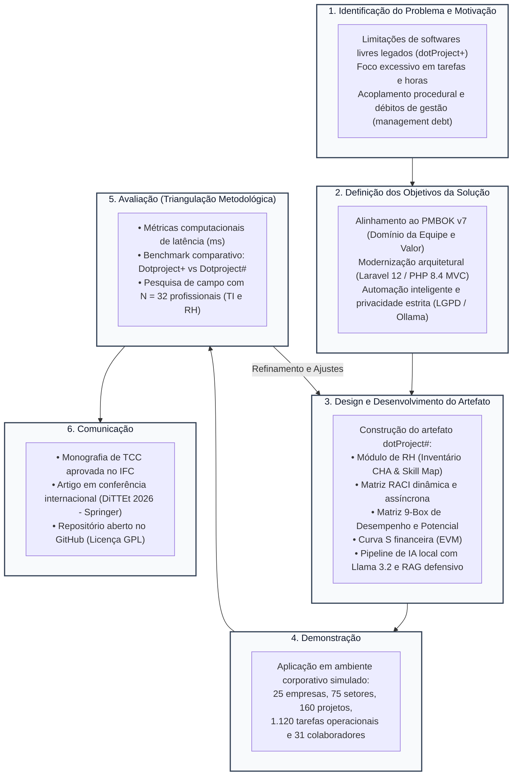

# 2. Metodologia de Pesquisa: Design Science Research (DSR)

Este documento atende diretamente aos comentários dos avaliadores:
* **Prof. Dr. Luis Augusto Silva Zendron (Item 1):** *"Metodologia carece de revisão devido à falta de detalhamento. Sugestão: Adotar DSR como linha principal (com fundamentação teórica)"*.
* **Prof. Dr. Rafael de Moura Speroni (Itens 5 e 6):** *"Revisar a metodologia conforme os comentários do Prof. Luis"* e *"Expandir a seção referente à metodologia e detalhar a figura apresentada"*.

---

## 2.1 Enquadramento Metodológico: Design Science Research (DSR)

A condução deste Trabalho de Conclusão de Curso fundamenta-se no método de pesquisa **Design Science Research (DSR)**, consagrado na literatura de Sistemas de Informação e Engenharia de Software para a concepção, desenvolvimento e avaliação rigorosa de artefatos tecnológicos inovadores destinados à resolução de problemas práticos complexos (HEVNER et al., 2004; PEFFERS et al., 2007; DRESCH; LACERDA; ANTUNES JÚNIOR, 2015; VAISHNAVI; KUECHLER, 2015).

Diferente das abordagens das ciências tradicionais (como as ciências naturais e sociais), cujo objetivo primário repousa em descrever, explicar ou predizer fenômenos existentes ("o que é"), o paradigma da *Design Science* dedica-se à produção do conhecimento prescritivo e utilitário ("o que deve ser"), orientando-se à criação de novos artefatos artificiais que transformem situações problemáticas em condições desejadas (SIMON, 1996; MARCH; SMITH, 1995).

Conforme estabelecido por Hevner et al. (2004), uma investigação orientada a DSR estrutura-se no equilíbrio dinâmico entre dois pilares epistemológicos:
1. **Relevância (Ambiente de Negócios):** O problema investigado deve originar-se de lacunas concretas identificadas na prática profissional das organizações (no caso presente, a defasagem operacional e metodológica de softwares de gerenciamento de projetos em MPEs, caracterizada pela negligência do fator humano e pelo surgimento de déficits gerenciais — *management debt*);
2. **Rigor Científico (Base de Conhecimento):** O desenvolvimento e a validação do artefato devem fundamentar-se em teorias consolidadas, padrões de engenharia de software e metodologias prescritivas de mercado (aqui representados pelas diretrizes do Guia PMBOK 7ª edição, pela arquitetura em camadas MVC, pelo framework Laravel 12 e por técnicas de inteligência artificial generativa local com privacidade de dados).

---

## 2.2 Fases do Ciclo de Pesquisa DSRM (Design Science Research Methodology)

Para operacionalizar o método DSR de forma sistemática e auditável, este trabalho adotou o modelo de ciclo de vida proposto por Peffers et al. (2007), denominado *Design Science Research Methodology* (DSRM). O processo é composto por seis etapas iterativas, detalhadas a seguir:

*Figura 2 – Fluxograma das fases de pesquisa baseadas na metodologia DSRM. Fonte: Elaborado pelo autor (2026), adaptado de Peffers et al. (2007).*

---

### Detalhamento das Etapas Metodológicas Executadas:

### Etapa 1: Identificação do Problema e Motivação
* **Contexto e Diagnóstico:** Identificou-se que as ferramentas de gerenciamento de projetos de código aberto (com destaque para o *dotProject+*, desenvolvido pela UFSC entre 2014 e 2018) foram estruturadas prioritariamente sob a égide das versões anteriores do Guia PMBOK (5ª e 6ª edições). Tais plataformas privilegiavam o controle prescritivo de prazos, custos e cronogramas, desprovidas de módulos analíticos para governança de equipes.
* **Impacto:** Conforme apontado na literatura contemporânea (DAYAN-AKMAN et al., 2025; RESTREPO-TAMAYO et al., 2025), a ausência de mecanismos integrados para balanceamento de competências gera o surgimento de "silos de informação", atritos entre membros e a elevação contínua da dívida de gestão (*management debt*). Além disso, a dependência de código procedural defasado em PHP 5.2/MySQL 5.0 impedia a integração de tecnologias modernas.

### Etapa 2: Definição dos Objetivos da Solução
* **Metas Qualitativas e Conceituais:** Transpor os princípios de entrega de valor e o *Domínio de Desempenho da Equipe* preconizados pelo Guia PMBOK 7ª edição (PMI, 2021) em funcionalidades de software navegáveis.
* **Metas Técnicas e Arquiteturais:** Reestruturar inteiramente o código-fonte sob o padrão arquitetural MVC no framework Laravel 12 e PHP 8.4; incorporar a tecnologia de Large Language Models (LLMs) executada de forma estritamente local (Ollama) para automação de tarefas cognitivas (decomposição de EAP e consultas em linguagem natural), eliminando riscos de vazamento de dados sensíveis perante a LGPD (Lei nº 13.709/2018).

### Etapa 3: Design e Desenvolvimento do Artefato
* **Natureza do Artefato:** Conforme a taxonomia de Hevner et al. (2004), o artefato concebido enquadra-se como um **sistema de informação instanciado (Software Prototype / System)**, complementado por **modelos relacionais** e **métodos operacionais**.
* **Engenharia de Software:** Foram especificados 11 requisitos funcionais (RF01 a RF11) e 8 requisitos não-funcionais (RNF01 a RNF08). O desenvolvimento contemplou:
  1. Criação do modelo relacional normalizado no MySQL com restrições de integridade referencial ACID;
  2. Implementação do inventário de competências individuais e coletivas (CHA) com renderização de gráficos de radar (*Skill Map* via Chart.js);
  3. Construção da Matriz de Responsabilidades (RACI) assíncrona com manipulação de DOM em tempo real via Fetch API;
  4. Desenvolvimento da Matriz de Desempenho e Potencial (9-Box);
  5. Cálculo e plotagem dinâmica da Curva S orçamentária utilizando técnicas de Gerenciamento de Valor Agregado (EVM);
  6. Orquestração do pipeline de inteligência artificial com injeção de contexto estruturado (RAG adaptado), engenharia de prompt restritivo e parsing defensivo contra alucinações.

### Etapa 4: Demonstração
* **Cenário de Aplicação:** Para demonstrar a operabilidade do artefato em situações análogas às vivenciadas por Micro e Pequenas Empresas (MPEs) de desenvolvimento de software, concebeu-se um ecossistema operacional de alta complexidade contendo 25 empresas, 75 departamentos setoriais, 160 projetos ativos, 1.120 tarefas operacionais e 31 colaboradores.
* **Execução Prática:** Todas as funcionalidades de negócio foram operadas, desde a montagem automatizada de uma EAP via IA local até a distribuição de papéis na Matriz RACI e a geração do diagnóstico visual da Curva S.

### Etapa 5: Avaliação (Triangulação Metodológica)
Visando conferir solidez científica e evitar vieses interpretativos, a avaliação do artefato adotou a **triangulação metodológica** (JICK, 1979; HEVNER et al., 2004), combinando:
1. **Avaliação Computacional Objetiva (Benchmarks de Laboratório):** Mensuração do tempo de resposta (em milissegundos) das principais rotinas transacionais do *dotProject#* em comparação com a ferramenta legada *dotProject+*, monitoramento da latência de inferência de IA local (GPU vs. CPU) e auditoria de tráfego de rede para validação do isolamento de dados (*zero data egress*);
2. **Avaliação Empírica Subjetiva (Percepção de Especialistas):** Aplicação de questionário estruturado com Escala Likert de 5 pontos a uma amostra de 32 profissionais atuantes das áreas de Tecnologia da Informação ($n = 24$) e Recursos Humanos ($n = 8$), submetendo os dados a tratamento estatístico descritivo (médias, desvios padrões e análise de concordância);
3. **Confrontamento Teórico:** Cruzamento dos achados com os estudos correlatos de literatura e com as diretrizes do Guia PMBOK v7.

### Etapa 6: Comunicação
* **Divulgação Acadêmica e Científica:** Os resultados obtidos, a modelagem arquitetural e a validação empírica do artefato foram formalizados nesta monografia e submetidos/aprovados para publicação nos anais do *International Conference on New Trends in Disruptive Technologies, Tech Ethics and Artificial Intelligence* (DiTTEt 2026), vinculado à série *Advances in Intelligent Systems and Computing* da editora internacional Springer (RIBAS et al., 2026).
* **Disponibilização Aberta:** Todo o código-fonte, esquemas de migração e documentação foram disponibilizados em repositório público no GitHub sob licença de software livre (GNU GPL), permitindo replicação, auditoria e extensibilidade pela comunidade técnica e acadêmica.

---

## 2.3 Referências Metodológicas

* DRESCH, A.; LACERDA, D. P.; ANTUNES JÚNIOR, J. A. V. **Design Science Research: método de pesquisa para avanço da ciência e tecnologia**. Porto Alegre: Bookman, 2015.
* HEVNER, A. R.; MARCH, S. T.; PARK, J.; RAM, S. Design Science in Information Systems Research. **MIS Quarterly**, v. 28, n. 1, p. 75-105, 2004.
* JICK, T. D. Mixing Qualitative and Quantitative Methods: Triangulation in Action. **Administrative Science Quarterly**, v. 24, n. 4, p. 602-611, 1979.
* MARCH, S. T.; SMITH, G. F. Design and natural science research on information technology. **Decision Support Systems**, v. 15, n. 4, p. 251-266, 1995.
* PEFFERS, K.; TUUNANEN, T.; ROTHENBERGER, M. A.; CHATTERJEE, S. A Design Science Research Methodology for Information Systems Research. **Journal of Management Information Systems**, v. 24, n. 3, p. 45-77, 2007.
* SIMON, H. A. **The Sciences of the Artificial**. 3. ed. Cambridge: MIT Press, 1996.
* VAISHNAVI, V.; KUECHLER, W. **Design Science Research Methods and Patterns: innovating information and communication technology**. 2. ed. Boca Raton: CRC Press, 2015.
