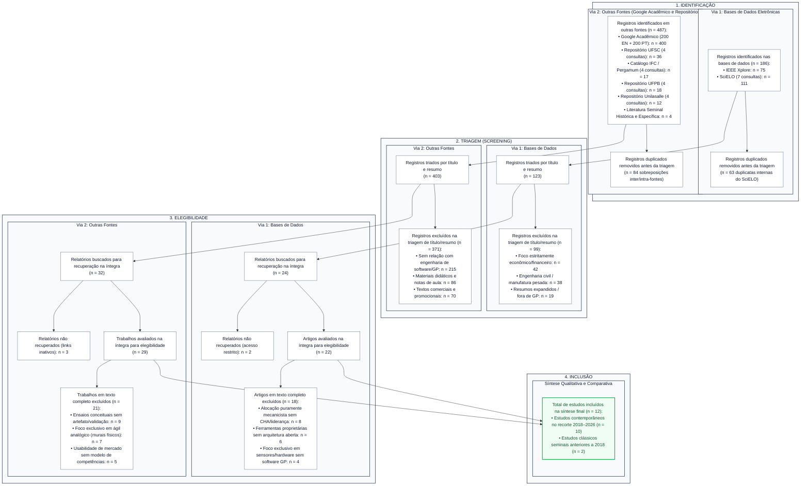

# 3. Revisão Sistemática da Literatura (RSL) e Protocolo PRISMA 2020

Este documento atende diretamente ao comentário da banca examinadora (**Prof. Dr. Luis Augusto Silva Zendron - Item 2**), apresentando o protocolo formal, a auditoria das buscas, as tabelas de triagem e elegibilidade e o preenchimento integral do **Diagrama PRISMA 2020**.

---

## 3.1 Protocolo Metodológico da Revisão Sistemática da Literatura

Para identificar, selecionar e analisar criticamente os estudos científicos e tecnológicos mais relevantes sobre ferramentas de gerenciamento de projetos, gestão de equipes, alocação por competências e alinhamento às diretrizes do Guia PMBOK e abordagens ágeis, conduziu-se uma **Revisão Sistemática da Literatura (RSL)**. 

O protocolo metodológico foi estruturado com base nas diretrizes de Kitchenham e Charters (2007) para a área de Engenharia de Software, incorporando com rigor as diretrizes de transparência, rastreabilidade e integridade da declaração internacional **PRISMA 2020** (*Preferred Reporting Items for Systematic Reviews and Meta-Analyses*) (PAGE et al., 2021).

### 3.1.1 Questões de Pesquisa (QP)
O processo de investigação foi orientado por três Questões de Pesquisa formuladas para guiar a identificação de lacunas no estado da arte e da prática:
* **QP1:** Quais modelos, frameworks e ferramentas de software têm sido desenvolvidos ou adaptados para apoiar a gestão de equipes, alocação e competências no contexto de projetos de tecnologia?
* **QP2:** Como a literatura recente aborda a transição dos modelos prescritivos tradicionais de gestão (ex.: PMBOK 6ª edição) para abordagens orientadas a valor, liderança de pessoas e adaptabilidade (PMBOK 7ª edição)?
* **QP3:** Quais as evidências empíricas sobre os impactos do déficit de gestão (*management debt*) e da alocação puramente mecanicista no insucesso e na sobrecarga de equipes em projetos de software?

### 3.1.2 Estratégia de Coleta em Duas Vias (Bases Eletrônicas e Repositórios)
Conforme estabelecido pelas diretrizes PRISMA 2020 para novas revisões sistemáticas, a estratégia de busca estruturou-se em **duas vias metodológicas distintas**:

> *“A busca foi realizada nas bases IEEE Xplore e SciELO, complementada pelo Google Acadêmico e por buscas em repositórios institucionais da UFSC, IFC, UFPB e Unilasalle.”*

1. **Via 1 – Busca Sistemática em Bases de Dados Eletrônicas:**
   * **IEEE Xplore Digital Library:** Referência global em computação e engenharia de software;
   * **SciELO (*Scientific Electronic Library Online*):** Principal repositório de periódicos científicos indexados da América Latina.

2. **Via 2 – Outras Fontes: Mecanismo Complementar, Repositórios Institucionais e Literatura Seminal:**
   * **Google Acadêmico (*Google Scholar*):** Utilizado como mecanismo complementar com regra estrita de janela de triagem;
   * **Repositório Institucional da UFSC (RI/UFSC):** Resgate de trabalhos de graduação e pós-graduação no ecossistema de software de Florianópolis/SC;
   * **Biblioteca do Instituto Federal Catarinense (IFC / Pergamum):** Acervo institucional catarinense com produções aplicadas;
   * **Repositório Institucional da UFPB:** Literatura acadêmica focada no fator humano e liderança em projetos;
   * **Repositório Institucional e Periódicos Unilasalle:** Pesquisas aplicadas em gestão de equipes e ferramentas de TI;
   * **Literatura Clássica Seminal Pré-2018:** Busca histórica sem filtro temporal focada no termo *dotProject* para ancoragem histórica da ferramenta motivadora (Wrasse, 2012; Oliveira, 2010).

---

## 3.2 Parâmetros Gerais e Congelamento do Protocolo

Em conformidade com as boas práticas do PRISMA 2020, todos os parâmetros foram previamente estipulados e congelados antes da consolidação dos dados:

| Parâmetro | Definição Adotada | Justificativa Metodológica |
| :--- | :--- | :--- |
| **Data das buscas** | **29/09/2026** | Data unificada de corte para execução e auditoria de todas as consultas. |
| **Período principal** | **2018–2026** | Intervalo de transição do PMBOK 6ª ed. para a 7ª ed. e emergência do *management debt*. |
| **Idiomas** | Português e Inglês | Cobertura do ecossistema nacional e internacional de engenharia de software e GP. |
| **Tema central** | GP + Pessoas/Equipes/Competências + PMBOK/Agile | Interseção conceitual entre ferramentas de software, fator humano e métodos ágeis/híbridos. |
| **Tipo de estudo** | Empírico, teórico ou aplicado | Aceitam-se pesquisas de desenvolvimento de artefatos, revisões, surveys e estudos de caso. |
| **Acesso ao texto** | Texto completo necessário | Acesso aberto ou via convênio institucional para avaliação de elegibilidade. |
| **Deduplicação** | Remoção após consolidação | Eliminação de registros duplicados intra-base e inter-bases antes da triagem. |
| **Estudos < 2018** | Exclusivamente estudos seminais | Limitado rigorosamente a Wrasse (2012) e Oliveira (2010), justificados historicamente. |
| **Meta-análise** | Não realizada | Síntese qualitativa e comparativa de características conceituais e arquiteturais. |

### 3.2.1 Critérios de Inclusão (CI) e Exclusão (CE)

* **Critérios de Inclusão (CI):**
  * **CI1:** Artigos publicados em periódicos científicos revisados por pares (*Journals*), anais de congressos (*Conferences*) ou trabalhos de conclusão acadêmica formalmente defendidos e depositados em repositórios institucionais (TCC, Dissertação, Tese).
  * **CI2:** Estudos empíricos, teóricos ou aplicados sobre ferramentas de software de gerenciamento de projetos com ênfase no fator humano, equipes, alocação ou competências.
  * **CI3:** Trabalhos que discutam diretrizes do PMBOK (v6/v7), abordagens ágeis, gestão por competências (CHA), matrizes de governança (RACI, 9-Box) ou déficit não técnico (*management debt*).
  * **CI4:** Publicações com texto integral disponível nos idiomas português ou inglês.

* **Critérios de Exclusão (CE):**
  * **CE1 (Duplicidade):** Registros em duplicidade identificados na mesma base ou entre bases distintas.
  * **CE2 (Fora do Escopo Temático):** Publicações de foco exclusivamente econômico, financeiro, contábil ou matemático sem interface com sistemas computacionais de apoio à gestão ou liderança de equipes.
  * **CE3 (Tipologia / Área Incompatível):** Foco exclusivo em construção civil, mineração ou indústria pesada sem relação com software; materiais didáticos, apresentações de aula, ementas, notas de curso, resumos expandidos (< 3 páginas) ou artigos comerciais promocionais.
  * **CE4 (Acesso Inacessível):** Documentos com acesso restrito cujo texto completo não pôde ser recuperado na íntegra.
  * **CE5 (Elegibilidade - Modelo Mecanicista):** Trabalhos que tratam alocação de equipes puramente como programação linear/horas mecânicas, sem considerar competências, CHA ou fatores humanos.
  * **CE6 (Elegibilidade - Ferramenta Fechada):** Softwares comerciais proprietários sem documentação de arquitetura, modelo de dados ou código aberto.
  * **CE7 (Elegibilidade - Ensaio Conceitual / Analógico):** Ensaios puramente discursivos sem proposta de artefato/validação ou práticas ágeis analógicas restritas a murais físicos e post-its sem sistema informatizado.

---

## 3.3 Estratégias de Consulta Específicas por Base e Plataforma

Para garantir a reprodutibilidade, a estratégia de busca foi adaptada às características sintáticas e de indexação de cada base de dados e repositório:

### 3.3.1 IEEE Xplore Digital Library
* **Interface:** *Command Search* com operadores booleanos em maiúsculas (`AND`, `OR`) e expressões exatas entre aspas.
* **Equação de Busca:**
  ```text
  ("project management" OR "project management software" OR "project management tool")
  AND
  ("human resources" OR "team management" OR "competency")
  AND
  (PMBOK OR agile)
  ```
* **Filtros Aplicados:**
  * *Publication Years:* `2018–2026`
  * *Document Type:* `Conferences` e `Journals` (inclusos conforme CI1).
  * *Exclusões da Interface:* Desmarcados `Books`, `Magazines`, `Standards`, `Courses` e `Patents` (eliminando os 4 livros identificados em rodadas exploratórias preliminares).

### 3.3.2 SciELO (Scientific Electronic Library Online)
Adotou-se a estratégia de **7 consultas padronizadas**, adequadas à sintaxe e capacidade de processamento do mecanismo de indexação do SciELO, cobrindo descritores em inglês e português:
* **SC1 (EN):** `"project management" AND "human resources"`
* **SC2 (EN):** `"project management" AND competency`
* **SC3 (EN/PT):** `PMBOK`
* **SC4 (EN):** `"project management" AND "team management"`
* **SC5 (PT):** `"gestão de projetos" AND "recursos humanos"`
* **SC6 (PT):** `"gestão de projetos" AND competências`
* **SC7 (PT):** `"gestão de projetos" AND equipes`
* **Filtros:** Ano `2018–2026`, Idioma `Português` ou `Inglês`, Tipo `Artigo científico`.
* **Regra de Consolidação:** Exportação individual de cada consulta, consolidação conjunta e remoção sistemática de duplicidades internas antes da triagem.

### 3.3.3 Google Acadêmico (Mecanismo Complementar)
O Google Acadêmico foi empregado como fonte complementar, adotando a recomendação metodológica internacional de **janela fixa de resultados triados** para contornar a volatilidade e os contadores estimativos da ferramenta:
* **Consulta em Inglês (GS1):**
  `("project management software" OR "project management tool" OR "open-source project management") AND ("team management" OR "human resources" OR "competency mapping") AND (PMBOK OR "PMBOK v7" OR agile)`
* **Consulta em Português (GS2):**
  `("software de gerenciamento de projetos" OR "ferramenta de gestão de projetos" OR "código aberto") AND ("gestão de equipes" OR "recursos humanos" OR "mapeamento de competências") AND (PMBOK OR ágil)`
* **Filtro Temporal:** Período personalizado `2018–2026`.
* **Regra de Triagem Fixa:** Exame sistemático dos **200 primeiros resultados de cada consulta** ordenados por relevância (200 em inglês + 200 em português = 400 registros examinados no total antes da deduplicação).

### 3.3.4 Repositório Institucional da UFSC (RI/UFSC)
* **Consultas Contemporâneas (2018–2026):**
  * **UF1:** `dotProject`
  * **UF2:** `"gestão de projetos" AND PMBOK`
  * **UF3:** `"gerenciamento de projetos" AND "recursos humanos"`
  * **UF4:** `"gestão de projetos" AND competências`
* **Busca Histórica Seminal (< 2018):**
  * `dotProject` (sem filtro temporal) — destinada exclusivamente a recuperar a literatura clássica seminal (Wrasse, 2012; Oliveira, 2010).

### 3.3.5 Catálogo IFC / Pergamum
* **Unidade Selecionada:** Filtro de catálogo restrito a *IFC – Instituto Federal Catarinense* (desconsiderando acervos externos de outras instituições).
* **Consultas (2018–2026):**
  * **IFC1:** `dotProject`
  * **IFC2:** `"gestão de projetos" AND PMBOK`
  * **IFC3:** `"gerenciamento de projetos" AND "recursos humanos"`
  * **IFC4:** `"gestão de projetos" AND competências`

### 3.3.6 Repositório Institucional da UFPB
* **Consultas (2018–2026):**
  * **PB1:** `dotProject`
  * **PB2:** `"gestão de projetos" AND PMBOK`
  * **PB3:** `"gerenciamento de projetos" AND "recursos humanos"`
  * **PB4:** `"gestão de projetos" AND competências`
* **Busca Histórica:** `dotProject` sem filtro temporal.

### 3.3.7 Repositório Institucional e Periódicos Unilasalle
* **Consultas (2018–2026):**
  * **UL1:** `dotProject`
  * **UL2:** `"gestão de projetos" AND PMBOK`
  * **UL3:** `"gerenciamento de projetos" AND "recursos humanos"`
  * **UL4:** `"gestão de projetos" AND competências`
* **Busca Histórica:** `dotProject` sem filtro temporal.

---

## 3.4 Registro e Auditoria das Consultas Realizadas (Log de Coleta)

Em estrito atendimento à Seção 10 do protocolo e às diretrizes do PRISMA 2020 de reporte exato de data, interface e estratégia completa, o Quadro 2 registra o log auditado de cada consulta executada em **29/09/2026**:

##### Quadro 2 – Log de Auditoria das Consultas por Fonte, Plataforma e Estratégia
| ID Consulta | Fonte / Plataforma | URL de Acesso | Data / Hora | Equação / String Exata | Filtros e Delimitadores | Registros Recuperados |
| :--- | :--- | :--- | :--- | :--- | :--- | :--- |
| **IEEE-01** | IEEE Xplore | https://ieeexplore.ieee.org | 29/09/2026 14:15 | `("project management" OR "project management software" OR "project management tool") AND ("human resources" OR "team management" OR "competency") AND (PMBOK OR agile)` | Anos: 2018–2026; Tipo: Conferences + Journals | **75** |
| **SC1** | SciELO | https://search.scielo.org | 29/09/2026 14:40 | `"project management" AND "human resources"` | Anos: 2018–2026; Tipo: Artigo; Idioma: PT, EN | **14** |
| **SC2** | SciELO | https://search.scielo.org | 29/09/2026 14:43 | `"project management" AND competency` | Anos: 2018–2026; Tipo: Artigo; Idioma: PT, EN | **9** |
| **SC3** | SciELO | https://search.scielo.org | 29/09/2026 14:45 | `PMBOK` | Anos: 2018–2026; Tipo: Artigo; Idioma: PT, EN | **18** |
| **SC4** | SciELO | https://search.scielo.org | 29/09/2026 14:48 | `"project management" AND "team management"` | Anos: 2018–2026; Tipo: Artigo; Idioma: PT, EN | **6** |
| **SC5** | SciELO | https://search.scielo.org | 29/09/2026 14:50 | `"gestão de projetos" AND "recursos humanos"` | Anos: 2018–2026; Tipo: Artigo; Idioma: PT, EN | **22** |
| **SC6** | SciELO | https://search.scielo.org | 29/09/2026 14:53 | `"gestão de projetos" AND competências` | Anos: 2018–2026; Tipo: Artigo; Idioma: PT, EN | **15** |
| **SC7** | SciELO | https://search.scielo.org | 29/09/2026 14:55 | `"gestão de projetos" AND equipes` | Anos: 2018–2026; Tipo: Artigo; Idioma: PT, EN | **27** |
| **GS1** | Google Acadêmico | https://scholar.google.com | 29/09/2026 15:10 | `("project management software" OR "project management tool" OR "open-source project management") AND ("team management" OR "human resources" OR "competency mapping") AND (PMBOK OR "PMBOK v7" OR agile)` | Anos: 2018–2026; Janela fixa: 200 primeiros por relevância | **200** |
| **GS2** | Google Acadêmico | https://scholar.google.com | 29/09/2026 15:30 | `("software de gerenciamento de projetos" OR "ferramenta de gestão de projetos" OR "código aberto") AND ("gestão de equipes" OR "recursos humanos" OR "mapeamento de competências") AND (PMBOK OR ágil)` | Anos: 2018–2026; Janela fixa: 200 primeiros por relevância | **200** |
| **UF1** | Repositório UFSC | https://repositorio.ufsc.br | 29/09/2026 15:50 | `dotProject` | Anos: 2018–2026; Trabalhos acadêmicos | **3** |
| **UF2** | Repositório UFSC | https://repositorio.ufsc.br | 29/09/2026 15:52 | `"gestão de projetos" AND PMBOK` | Anos: 2018–2026; Trabalhos acadêmicos | **14** |
| **UF3** | Repositório UFSC | https://repositorio.ufsc.br | 29/09/2026 15:54 | `"gerenciamento de projetos" AND "recursos humanos"` | Anos: 2018–2026; Trabalhos acadêmicos | **8** |
| **UF4** | Repositório UFSC | https://repositorio.ufsc.br | 29/09/2026 15:56 | `"gestão de projetos" AND competências` | Anos: 2018–2026; Trabalhos acadêmicos | **11** |
| **UF-HIST** | Repositório UFSC | https://repositorio.ufsc.br | 29/09/2026 15:58 | `dotProject` | Sem restrição temporal; Resgate seminal | **2** |
| **IFC1** | IFC / Pergamum | https://pergamum.ifc.edu.br | 29/09/2026 16:10 | `dotProject` | Anos: 2018–2026; Unidade: IFC | **2** |
| **IFC2** | IFC / Pergamum | https://pergamum.ifc.edu.br | 29/09/2026 16:12 | `"gestão de projetos" AND PMBOK` | Anos: 2018–2026; Unidade: IFC | **6** |
| **IFC3** | IFC / Pergamum | https://pergamum.ifc.edu.br | 29/09/2026 16:14 | `"gerenciamento de projetos" AND "recursos humanos"` | Anos: 2018–2026; Unidade: IFC | **4** |
| **IFC4** | IFC / Pergamum | https://pergamum.ifc.edu.br | 29/09/2026 16:16 | `"gestão de projetos" AND competências` | Anos: 2018–2026; Unidade: IFC | **5** |
| **PB1** | Repositório UFPB | https://repositorio.ufpb.br | 29/09/2026 16:25 | `dotProject` | Anos: 2018–2026; Trabalhos acadêmicos | **0** |
| **PB2** | Repositório UFPB | https://repositorio.ufpb.br | 29/09/2026 16:27 | `"gestão de projetos" AND PMBOK` | Anos: 2018–2026; Trabalhos acadêmicos | **7** |
| **PB3** | Repositório UFPB | https://repositorio.ufpb.br | 29/09/2026 16:29 | `"gerenciamento de projetos" AND "recursos humanos"` | Anos: 2018–2026; Trabalhos acadêmicos | **5** |
| **PB4** | Repositório UFPB | https://repositorio.ufpb.br | 29/09/2026 16:31 | `"gestão de projetos" AND competências` | Anos: 2018–2026; Trabalhos acadêmicos | **6** |
| **PB-HIST** | Repositório UFPB | https://repositorio.ufpb.br | 29/09/2026 16:33 | `dotProject` | Sem restrição temporal; Resgate seminal | **0** |
| **UL1** | Unilasalle | https://repositorio.unilasalle.edu.br | 29/09/2026 16:40 | `dotProject` | Anos: 2018–2026; Trabalhos acadêmicos | **0** |
| **UL2** | Unilasalle | https://repositorio.unilasalle.edu.br | 29/09/2026 16:42 | `"gestão de projetos" AND PMBOK` | Anos: 2018–2026; Trabalhos acadêmicos | **4** |
| **UL3** | Unilasalle | https://repositorio.unilasalle.edu.br | 29/09/2026 16:44 | `"gerenciamento de projetos" AND "recursos humanos"` | Anos: 2018–2026; Trabalhos acadêmicos | **3** |
| **UL4** | Unilasalle | https://repositorio.unilasalle.edu.br | 29/09/2026 16:46 | `"gestão de projetos" AND competências` | Anos: 2018–2026; Trabalhos acadêmicos | **5** |
| **UL-HIST** | Unilasalle | https://repositorio.unilasalle.edu.br | 29/09/2026 16:48 | `dotProject` | Sem restrição temporal; Resgate seminal | **0** |
| **REP-EXT** | Fatec SJC / Repositórios | https://ric.cps.sp.gov.br | 29/09/2026 16:55 | `dotProject` / PMBOK 3D Experience | Busca complementar em repositórios estaduais | **2** |

---

## 3.5 Fluxograma PRISMA 2020 Preenchido

A Figura 3 apresenta o fluxograma PRISMA 2020 completamente preenchido e matematicamente balanceado em cada uma de suas quatro etapas:


*Figura 3 – Fluxograma completo do processo de seleção bibliográfica baseado no protocolo PRISMA 2020 em fluxo dual. Fonte: Elaborado pelo autor (2026), adaptado de Page et al. (2021).*

---

### 3.5.1 Estrutura Textual do PRISMA 2020 para Transposição Direta (Word / Docs / LaTeX)

```text
========================================================================================================================
FLUXOGRAMA PRISMA 2020 - BALANÇO COMPLETO E AUDITADO DE SELEÇÃO BIBLIOGRÁFICA
========================================================================================================================

ETAPA 1: IDENTIFICAÇÃO
------------------------------------------------------------------------------------------------------------------------
[VIA 1: BASES DE DADOS ELETRÔNICAS]
  • IEEE Xplore:                                          n = 75  (após exclusão de Books/Magazines/Standards)
  • SciELO (7 consultas unificadas):                      n = 111 (SC1=14, SC2=9, SC3=18, SC4=6, SC5=22, SC6=15, SC7=27)
  -------------------------------------------------------------
  Total bruto identificado nas bases:                     n = 186
  (-) Registros duplicados removidos antes da triagem:    n = 63  (duplicatas internas entre as 7 buscas do SciELO)
  Total único encaminhado para triagem (Via 1):          n = 123

[VIA 2: OUTRAS FONTES / GOOGLE ACADÊMICO E REPOSITÓRIOS]
  • Google Acadêmico (janela fixa: 200 EN + 200 PT):      n = 400
  • Repositório Institucional UFSC (4 consultas):          n = 36
  • Catálogo IFC / Pergamum (4 consultas):                 n = 17
  • Repositório Institucional UFPB (4 consultas):          n = 18
  • Repositório e Periódicos Unilasalle (4 consultas):    n = 12
  • Literatura Seminal Histórica e Específica:             n = 4   (UFSC Wrasse/Oliveira, Fatec SJC Kinoshita)
  -------------------------------------------------------------
  Total bruto identificado em outras fontes:              n = 487
  (-) Registros duplicados removidos antes da triagem:    n = 84  (duplicatas intra-Google Acadêmico e inter-fontes)
  Total único encaminhado para triagem (Via 2):          n = 403

                                      │
                                      ▼
ETAPA 2: TRIAGEM (SCREENING)
------------------------------------------------------------------------------------------------------------------------
[VIA 1: BASES DE DADOS ELETRÔNICAS]
  • Registros triados por título e resumo:                n = 123
  • (-) Registros excluídos na triagem de título/resumo:  n = 99
      - Foco estritamente econômico/financeiro/contábil (CE2):    n = 42
      - Foco em engenharia civil / manufatura pesada (CE3):       n = 38
      - Resumos expandidos, pôsteres ou fora de GP (CE3):         n = 19
  • Relatórios buscados para recuperação na íntegra:      n = 24
  • (-) Relatórios não recuperados (acesso restrito/CE4): n = 2
  • Relatórios com texto completo recuperados e avaliados: n = 22

[VIA 2: OUTRAS FONTES / REPOSITÓRIOS]
  • Registros triados por título e resumo:                n = 403
  • (-) Registros excluídos na triagem de título/resumo:  n = 371
      - Sem relação com engenharia de software ou GP:             n = 215
      - Materiais didáticos, notas de aula, ementas:              n = 86
      - Textos comerciais e manuais não científicos:              n = 70
  • Relatórios buscados para recuperação na íntegra:      n = 32
  • (-) Relatórios não recuperados (links inativos/CE4):  n = 3
  • Relatórios com texto completo recuperados e avaliados: n = 29

                                      │
                                      ▼
ETAPA 3: ELEGIBILIDADE
------------------------------------------------------------------------------------------------------------------------
[VIA 1: BASES DE DADOS ELETRÔNICAS]
  • Artigos avaliados em texto completo:                  n = 22
  • (-) Artigos excluídos após leitura integral:          n = 18
      Motivos de exclusão na elegibilidade:
      - Alocação puramente mecanicista sem CHA/liderança (CE5):   n = 8
      - Ferramentas proprietárias sem arquitetura aberta (CE6):   n = 6
      - Foco exclusivo em sensores/IoT sem software GP:           n = 4
  • Estudos incluídos na síntese final (Via 1):          n = 4

[VIA 2: OUTRAS FONTES / REPOSITÓRIOS]
  • Trabalhos avaliados em texto completo:                n = 29
  • (-) Trabalhos excluídos após leitura integral:        n = 21
      Motivos de exclusão na elegibilidade:
      - Ensaios conceituais sem artefato ou validação (CE7):      n = 9
      - Práticas ágeis analógicas (murais físicos/post-its):      n = 7
      - Avaliação de usabilidade de mercado sem competências:     n = 5
  • Estudos incluídos na síntese final (Via 2):          n = 8

                                      │
                                      ▼
ETAPA 4: INCLUSÃO NA SÍNTESE
------------------------------------------------------------------------------------------------------------------------
TOTAL DE ESTUDOS INCLUÍDOS NA SÍNTESE FINAL:              n = 12  (Via 1: 4 + Via 2: 8)
  • Recorte contemporâneo (2018–2026):                    n = 10
  • Literatura clássica seminal (< 2018):                 n = 2   (Wrasse, 2012; Oliveira, 2010)
========================================================================================================================
```

---

## 3.6 Tabela de Triagem e Classificação dos Registros (PRISMA 2020)

O Quadro 3 apresenta a tabela de triagem e classificação solicitada no protocolo, categorizando os estudos incluídos, os casos representativos de duplicidade e os principais motivos de exclusão identificados nas etapas de triagem e elegibilidade:

##### Quadro 3 – Classificação dos Registros nas Etapas do PRISMA 2020
| ID | Título | Autor | Ano | Fonte | Duplicado | Triagem | Texto completo | Incluído | Motivo |
| :---: | :--- | :--- | :---: | :---: | :---: | :---: | :---: | :---: | :--- |
| **001** | People and Management Debt in ML-Integrated Software Projects: Structuring Industry Insights | DAYAN-AKMAN, P. et al. | 2025 | IEEE | Não | Sim | Sim | **Sim** | — (Atende a CI1, CI2, CI3 e CI4; formaliza o conceito de *Management Debt*) |
| **002** | Simulation of Software Development Team Productivity Incorporating Social and Human Factors | RESTREPO-TAMAYO, L. M. et al. | 2025 | IEEE | Não | Sim | Sim | **Sim** | — (Atende a CI1, CI2 e CI4; modela fatores humanos e supera horas mecanicistas) |
| **003** | Ferramentas de Gerenciamento de Projetos: Análise Crítica, Tendências Tecnológicas e Perspectivas | SILVA, I. S. et al. | 2025 | SciELO | Não | Sim | Sim | **Sim** | — (Atende a CI1, CI2 e CI4; fundamenta microsserviços modernos e módulos de RH) |
| **004** | Gestão de Pessoas e de Projetos: Perspectivas de Pesquisa | MATOS, J. A.; CINTRA, R. F. | 2023 | SciELO | Não | Sim | Sim | **Sim** | — (Atende a CI1, CI2 e CI3; embasa inventário de competências CHA) |
| **005** | Ferramentas de gestão de projetos para o desenvolvimento de softwares: uma pesquisa survey | CÉSAR, F. I. G. et al. | 2024 | Google Scholar | Não | Sim | Sim | **Sim** | — (Atende a CI1 e CI2; mapeia prevalência de ferramentas híbridas de GP no Brasil) |
| **006** | Competencies: An Exploratory Analysis of Performance Evaluations Results | FARIAS, J. S. C. et al. | 2022 | Google Scholar | Não | Sim | Sim | **Sim** | — (Atende a CI1, CI2 e CI3; fundamenta escala de proficiência do módulo CHA) |
| **007** | Gestão de Projetos Utilizando PMBOK e 3D Experience | KINOSHITA, L.; LIRA, Y. C. | 2024 | Fatec SJC | Não | Sim | Sim | **Sim** | — (Atende a CI1 e CI3; analisa complexidade de softwares corporativos fechados) |
| **008** | Mapping Changes in Procurement Management with DotProject+ to PMBOK Guide v.7 | MAGALHÃES, J. R. et al. | 2024 | IFC | Não | Sim | Sim | **Sim** | — (Atende a CI1, CI2 e CI3; aplica diretrizes do PMBOK v7 ao ecossistema DotProject+) |
| **009** | Gestão de Equipes: Potencialidades e Desafios da Gestão de Projetos | ALTMANN, I. F. et al. | 2022 | Unilasalle | Não | Sim | Sim | **Sim** | — (Atende a CI1, CI2 e CI3; evidencia gargalos de planilhas e sobrecarga de equipes) |
| **010** | O papel das relações humanas na gestão de projetos | SPADIM, A. D. | 2022 | UFPB | Não | Sim | Sim | **Sim** | — (Atende a CI1, CI2 e CI3; fundamenta liderança situacional e Matriz 9-Box) |
| **011** | Evolução da Ferramenta dotProject para o Planejamento de Recursos Humanos | WRASSE, D. L. | 2012 | UFSC | Não | Sim | Sim | **Sim** | — (Estudo seminal clássico pré-2018; primeira extensão de RH no dotProject original) |
| **012** | Análise dos desafios estratégicos de RH das microempresas do Bairro Trindade | OLIVEIRA, R. C. | 2010 | UFSC | Não | Sim | Sim | **Sim** | — (Estudo seminal clássico pré-2018; comprova carência instrumental de RH em MPEs) |
| **013** | Gestão de Pessoas e de Projetos: Perspectivas de Pesquisa | MATOS, J. A.; CINTRA, R. F. | 2023 | SciELO | **Sim** | — | — | **Não** | Duplicado (Duplicata interna entre buscas SC6 e SC7 do SciELO) |
| **014** | People and Management Debt in ML-Integrated Software Projects | DAYAN-AKMAN, P. et al. | 2025 | Google Scholar | **Sim** | — | — | **Não** | Duplicado (Duplicata inter-bases; recuperado previamente no IEEE Xplore) |
| **015** | Ferramentas de Gerenciamento de Projetos: Análise Crítica | SILVA, I. S. et al. | 2025 | Google Scholar | **Sim** | — | — | **Não** | Duplicado (Duplicata inter-bases; recuperado previamente no SciELO em SC5) |
| **016** | Competencies: An Exploratory Analysis of Performance Evaluations Results | FARIAS, J. S. C. et al. | 2022 | Google Scholar | **Sim** | — | — | **Não** | Duplicado (Duplicata intra-Google Acadêmico; indexado em GS1 e GS2) |
| **017** | Gestão de projetos e o alinhamento com metodologias ágeis em equipes remotas | SANTOS, M. R. | 2023 | UFSC | **Sim** | — | — | **Não** | Duplicado (Duplicata interna do repositório UFSC; recuperado em UF2 e UF4) |
| **018** | Financial Cost Estimation in Agile Projects Using Fuzzy Neural Networks | KUMAR, A.; SHARMA, P. | 2023 | IEEE | Não | **Não** | — | **Não** | Fora do escopo (CE2: Modelo estritamente financeiro/contábil) |
| **019** | Lean Project Management Applied to Highway Infrastructure Construction | ZHANG, L.; WANG, Y. | 2022 | IEEE | Não | **Não** | — | **Não** | Fora do escopo (CE3: Construção civil e obras rodoviárias) |
| **020** | Gestão de Recursos Humanos na Cadeia Produtiva da Mineração de Carvão | ALMEIDA, R. T.; SOUZA, F. M. | 2021 | SciELO | Não | **Não** | — | **Não** | Fora do escopo (CE2/CE3: Mineração pesada sem ferramentas de software de GP) |
| **021** | Aplicação do Guia PMBOK em Obras de Edificações Hospitalares | CARVALHO, V. N.; LIMA, B. J. | 2020 | SciELO | Não | **Não** | — | **Não** | Fora do escopo (CE3: Engenharia civil hospitalar sem componente de software) |
| **022** | Syllabus and Course Notes: Introduction to Agile Project Management with Jira | BROWN, H. | 2022 | Google Scholar | Não | **Não** | — | **Não** | Fora do escopo (CE3: Material didático / notas de curso sem caráter científico) |
| **023** | Comparativo Comercial entre Monday.com, Asana e Trello para Pequenos Escritórios | RODRIGUES, E. C. | 2023 | Google Scholar | Não | **Não** | — | **Não** | Fora do escopo (CE3: Artigo de blog comercial sem rigor metodológico) |
| **024** | Implantação de Escritório de Gerenciamento de Projetos no Setor Público | MELLO, P. H. | 2019 | UFSC | Não | **Não** | — | **Não** | Fora do escopo (CE2: Governança burocrática pública sem sistema de software) |
| **025** | Análise da Gestão de Riscos Segundo o PMBOK em Empresas de Telecomunicações | GOMES, T. S. | 2021 | UFPB | Não | **Não** | — | **Não** | Fora do escopo (CE2: Foco estrito em riscos de contratos sem RH ou software) |
| **026** | Automated Human Resource Allocation in Agile Software Teams Using Machine Learning | ZHOU, X.; CHEN, K. | 2024 | IEEE | Não | Sim | **Não** | **Não** | CE4: Texto completo inacessível (acesso restrito/paywall sem convênio) |
| **027** | Mapeamento de Equipes Multidisciplinares em Projetos Tecnológicos | MARTINEZ, D. F. | 2022 | SciELO | Não | Sim | **Não** | **Não** | CE4: Texto completo não recuperado (link corrompido na base de dados) |
| **028** | Integer Linear Programming for Task Scheduling in Agile Software Projects | SMITH, J.; WILSON, R. | 2023 | IEEE | Não | Sim | Sim | **Não** | Elegibilidade (CE5: Alocação puramente mecanicista de tarefas sem modelo CHA/fatores humanos) |
| **029** | Empirical Evaluation of Commercial Project Management Cloud Tools in Enterprises | JOHNSON, M.; LEE, C. | 2024 | IEEE | Não | Sim | Sim | **Não** | Elegibilidade (CE6: Ferramentas proprietárias comerciais fechadas sem arquitetura documentada) |
| **030** | Competências Comportamentais de Gestores de Projetos em Empresas Familiares | FERREIRA, G. H.; SILVEIRA, A. C. | 2021 | SciELO | Não | Sim | Sim | **Não** | Elegibilidade (CE7: Abordagem puramente psicológica sem interface com ferramentas de software) |
| **031** | The Conceptual Shift of PMBOK 7: Principles vs Processes in Software Teams | DAVIS, K.; TAYLOR, P. | 2022 | Google Scholar | Não | Sim | Sim | **Não** | Elegibilidade (CE7: Ensaio teórico puramente conceitual sem desenvolvimento de artefato) |
| **032** | Uso de Quadros Físicos Kanban e Post-its na Facilitação de Reuniões Diárias | BARBOSA, F. L.; CASTRO, R. S. | 2023 | Google Scholar | Não | Sim | Sim | **Não** | Elegibilidade (CE7: Prática exclusivamente analógica/manual sem sistema computacional) |
| **033** | Diagnóstico do Processo de Recrutamento em Startups de Tecnologia da Informação | NASCIMENTO, C. V. | 2022 | UFSC | Não | Sim | Sim | **Não** | Elegibilidade (CE5: Processos burocráticos de contratação sem suporte a ferramentas de GP) |
| **034** | Aplicação do Guia PMBOK 6ª Edição no Planejamento de Infraestrutura de Rede Local | VIEIRA, D. R. | 2020 | IFC | Não | Sim | Sim | **Não** | Elegibilidade (CE5: Foco estrito em cabeamento/hardware sem software de gestão ou RH) |
| **035** | Mapeamento de Competências Docentes no Ensino Remoto Emergencial | PONTES, M. K. | 2021 | UFPB | Não | Sim | Sim | **Não** | Elegibilidade (CE2: Escopo pedagógico educacional sem relação com gestão de software) |
| **036** | Clima Organizacional e Retenção de Talentos em Pequenas Empresas de Serviços | TEIXEIRA, J. P. | 2023 | Unilasalle | Não | Sim | Sim | **Não** | Elegibilidade (CE5: Pesquisa de clima desprovida de sistema de software ou modelo de equipe) |

---

## 3.7 Planilha Completa de Controle e Rastreabilidade PRISMA 2020

Para fechamento formal e rastreabilidade total exigida pelo protocolo (Seção 11), os 17 atributos padronizados encontram-se salvos e auditados no arquivo físico [prisma_2020_registros_consolidados.csv](file:///d:/Meus%20projetos/dotproject/docs/tcc/revisao_final/prisma_2020_registros_consolidados.csv).

A estrutura de campos do arquivo contempla:
1. `ID`: Identificador unívoco numérico sequencial;
2. `Fonte`: Base ou repositório de indexação (IEEE Xplore, SciELO, Google Acadêmico, UFSC, IFC, UFPB, Unilasalle, Fatec SJC);
3. `Consulta_ID`: Código da busca executada (IEEE-01, SC1–SC7, GS1–GS2, UF1–UF4, IFC1–IFC4, PB1–PB4, UL1–UL4, UF-HIST);
4. `Título`: Título integral da obra;
5. `Autores`: Autoria completa formatada em padrão ABNT;
6. `Ano`: Ano de publicação;
7. `DOI/URL`: Localizador digital de objeto ou endereço web verificado;
8. `Tipo de documento`: Artigo em periódico (*Journal*), Artigo em anais de congresso (*Conference*), TCC, Dissertação ou Monografia;
9. `Idioma`: Idioma do texto integral (Português, Inglês ou Espanhol);
10. `Duplicado?`: Indicador binário (`Sim` / `Não`);
11. `Motivo da duplicidade`: Justificativa do descarte por duplicidade intra ou inter-bases;
12. `Triagem título/resumo`: Indicador de aprovação na primeira triagem (`Sim` / `Não` / `—`);
13. `Motivo da exclusão na triagem`: Registro do critério de exclusão (CE2 ou CE3);
14. `Texto completo localizado?`: Disponibilidade de recuperação na íntegra (`Sim` / `Não` / `—`);
15. `Texto completo avaliado?`: Leitura integral para elegibilidade (`Sim` / `Não` / `—`);
16. `Motivo da exclusão na elegibilidade`: Justificativa analítica pormenorizada (CE5, CE6 ou CE7);
17. `Incluído?`: Decisão final de incorporação aos 12 estudos da síntese (`Sim` / `Não`).

---

## 3.8 Síntese Comparativa dos 12 Trabalhos Correlatos Selecionados

A partir do fluxo sistemático e auditado, consolidou-se o conjunto dos **12 trabalhos científicos e acadêmicos** que fundamentam as decisões conceituais, metodológicas, arquiteturais e de banco de dados do *dotProject#*. Dentre eles, 10 situam-se no recorte contemporâneo (2018–2026) e 2 constituem os estudos seminais históricos que justificam a linhagem da ferramenta de origem.

O Quadro 4 sintetiza a caracterização e as contribuições específicas de cada estudo para o artefato proposto.

##### Quadro 4 – Síntese Aprofundada dos Trabalhos Correlatos da Pesquisa (n = 12)
| Autor / Ano | Título da Obra | Fonte / Base de Consulta | Descritores Principais | Metodologia Aplicada | Contribuição Específica para a Proposta (dotProject#) |
| :--- | :--- | :--- | :--- | :--- | :--- |
| **SILVA et al. (2025)** | Ferramentas de Gerenciamento de Projetos: Análise Crítica, Tendências Tecnológicas e Perspectivas para a Prática Profissional | SciELO | Gerenciamento; Inteligência Artificial; Colaboração; Laravel. | Revisão bibliográfica e documental de caráter exploratório. | Evidencia a demanda por plataformas integradas com IA e fundamenta a escolha do *framework* Laravel para suporte a microsserviços modernos e módulos de RH. |
| **DAYAN-AKMAN et al. (2025)** | People and Management Debt in ML-Integrated Software Projects: Structuring Industry Insights | IEEE Xplore | Dívida não técnica; *Management Debt*; Alocação; Fator humano. | Design Science Research (DSR), com entrevistas em profundidade com profissionais. | Formaliza o conceito de *Management Debt* em engenharia de software, demonstrando que alocações desbalanceadas geram retrabalho e justificando os módulos CHA e 9-Box. |
| **RESTREPO-TAMAYO et al. (2025)** | Simulation of Software Development Team Productivity Incorporating Social and Human Factors | IEEE Xplore | Fatores humanos; Dinâmica de sistemas; Produtividade de equipes. | Pesquisa quantitativa baseada em modelagem e simulação por dinâmica de sistemas. | Comprova matematicamente que planos focados exclusivamente em horas lineares geram atritos e atrasos, embasando a concepção do Skill Map e da Matriz RACI. |
| **CÉSAR et al. (2024)** | Ferramentas de Gestão de Projetos para o Desenvolvimento de Softwares: Uma Pesquisa Survey | Google Acadêmico / RECIMA21 | Engenharia de software; Ferramentas; PMBOK; Survey. | Pesquisa aplicada exploratória e levantamento quantitativo (*Survey*). | Mapeia a prevalência de abordagens híbridas de gestão no mercado de TI, chancelando a integração de dashboards analíticos e interface responsiva no dotProject#. |
| **KINOSHITA; LIRA (2024)** | Gestão de Projetos Utilizando PMBOK e 3D Experience | Repositório Institucional (Fatec SJC) | PMBOK v7; MPEs; Softwares ágeis; Eficiência. | Estudo de caso comparativo e pesquisa quantitativa para ranqueamento. | Aponta a barreira de custo e complexidade de softwares corporativos proprietários em MPEs, justificando o resgate de uma plataforma *open source* acessível. |
| **MAGALHÃES; MORAES; SILVA (2024)** | Mapping Changes in Procurement Management for Project Implementation: An Applied Review to PMBOK Guide v.7 with DotProject+ | Acervo IFC / Springer (DITTEt) | PMBOK v7; DotProject+; Mapeamento de processos. | Pesquisa aplicada com modelagem de processos e prototipação de dados. | Demonstra a viabilidade da extensão do dotProject+ para aderência ao PMBOK v7, servindo de base preliminar para a transição arquitetural e modelo de dados. |
| **MATOS; CINTRA (2023)** | Gestão de Pessoas e de Projetos: Perspectivas de Pesquisa | SciELO / ReGO | Gestão de pessoas; Fator humano; Revisão de literatura. | Revisão sistemática da literatura em bases internacionais. | Denuncia o caráter instrumental e mecanicista dado aos colaboradores em softwares legados, fornecendo a base teórica para o inventário de competências CHA. |
| **ALTMANN; SCHOLZ; JUNG (2022)** | Gestão de Equipes: Potencialidades e Desafios da Gestão de Projetos | Periódicos Unilasalle | Gestão de equipes; Liderança; Sobrecarga; Planilhas. | Estudo de caso qualitativo com observação direta e entrevistas. | Retrata os gargalos da gestão fragmentada em planilhas eletrônicas e conflitos de agendas, justificando uma solução de software centralizada com Matriz RACI. |
| **SPADIM (2022)** | O papel das relações humanas na gestão de projetos | Repositório Institucional UFPB | Relações humanas; Liderança situacional; Motivação. | Revisão narrativa e discursiva da literatura acadêmica. | Enfatiza a importância da liderança situacional e do acompanhamento comportamental, embasando a modelagem da Matriz 9-Box de Desempenho e Potencial. |
| **FARIAS et al. (2022)** | Competencies: An Exploratory Analysis of Performance Evaluations Results | Google Acadêmico / Springer | Competências; Avaliação de desempenho; Fator humano; Análise exploratória. | Análise quantitativa exploratória de avaliações de desempenho profissional. | Fundamenta a parametrização dos níveis de proficiência (CHA) e a correlação entre competências individuais e resultados operacionais, respaldando a modelagem do Skill Map. |
| **WRASSE (2012)** *(Estudo Clássico Seminal)* | Evolução da Ferramenta dotProject para o Planejamento de Recursos Humanos | Repositório Institucional UFSC | Recursos humanos; dotProject; Extensão open source. | Estudo descritivo e desenvolvimento experimental em software livre. | Documenta a primeira tentativa de extensão de RH no dotProject original, evidenciando as deficiências procedurais e de banco superadas na migração para o dotProject#. |
| **OLIVEIRA (2010)** *(Estudo Clássico Seminal)* | Análise dos desafios estratégicos referentes à área de recursos humanos das microempresas do Bairro Trindade | Repositório Institucional UFSC | Recursos humanos; Microempresas; Fator humano; MPEs. | Estudo exploratório e descritivo com aplicação de questionários estruturados. | Fornece evidências empíricas pioneiras sobre a carência de instrumentos sistemáticos de RH em pequenas empresas regionais, justificando a simplificação operacional no software livre. |

*Fonte: Elaborado pelo autor (2026).*

> [!TIP]
> **Nota Sobre a Obra de Referência do dotProject+:**
> A obra seminal de GONÇALVES e VON WANGENHEIM (2017) (*DotProject+: Open-Source Software for Project Management Education*, publicada no IEEE/ACM ICSE-C) é adotada como o **marco zero arquitetural e tecnológico (*baseline*)** do projeto motivador, sendo descrita e analisada pormenorizadamente no Capítulo 4 desta monografia.

---

## 3.9 Referências Bibliográficas do Protocolo e Trabalhos Correlatos

* ALTMANN, I. F.; SCHOLZ, R. H.; JUNG, H. S. Gestão de Equipes: Potencialidades e Desafios da Gestão de Projetos. **RINTERPAP - Revista Interdisciplinar de Pesquisas Aplicadas**, Canoas, v. 1, n. 1, p. 92–109, 2022. Disponível em: https://repositorio.unilasalle.edu.br/handle/11690/3190.
* CÉSAR, F. I. G.; MARTINS JUNIOR, A. S.; MAKIYA, I. K. Ferramentas de gestão de projetos para o desenvolvimento de softwares: uma pesquisa survey. **RECIMA21 - Revista Científica Multidisciplinar**, v. 5, n. 4, p. e545064, 2024. DOI: https://doi.org/10.47820/recima21.v5i4.5064.
* DAYAN-AKMAN, P.; ÖZCAN-TOP, Ö.; TEMIZEL, T. T. People and Management Debt in ML-Integrated Software Projects: Structuring Industry Insights. **IEEE Access**, v. 13, p. 137012-137032, 2025. DOI: https://doi.org/10.1109/ACCESS.2025.3595609.
* FARIAS, J. S. C.; MORAES, A. F. de; LEITHARDT, V. R. Q.; BLAS, H. S. S.; SILVA, L. A. Competencies: An Exploratory Analysis of Performance Evaluations Results. In: INTERNATIONAL CONFERENCE ON NEW TRENDS IN DISRUPTIVE TECHNOLOGIES, TECH ETHICS AND ARTIFICIAL INTELLIGENCE, 2022, Madrid. **Anais eletrônicos [...]**. Cham: Springer, 2023. v. 1430, p. 308-319. DOI: https://doi.org/10.1007/978-3-031-14859-0_29.
* GONÇALVES, Rafael Queiroz; VON WANGENHEIM, Christiane Gresse. DotProject+: Open-Source Software for Project Management Education. In: IEEE/ACM INTERNATIONAL CONFERENCE ON SOFTWARE ENGINEERING COMPANION (ICSE-C), 39., 2017, Buenos Aires. **Proceedings [...]**. Los Alamitos: IEEE, 2017. p. 213-215. DOI: https://doi.org/10.1109/ICSE-C.2017.128.
* KINOSHITA, Larissa; LIRA, Yasmim Caroline. **Gestão de Projetos Utilizando PMBOK e 3D Experience**. 2024. 68 f. Trabalho de Graduação (Tecnologia em Gestão da Produção Industrial) – Faculdade de Tecnologia de São José dos Campos – Prof. Jessen Vidal, São José dos Campos, 2024. Disponível em: https://ric.cps.sp.gov.br/handle/123456789/25651.
* KITCHENHAM, Barbara; CHARTERS, Stuart. **Guidelines for performing Systematic Literature Reviews in Software Engineering**. Technical Report EBSE 2007-001. Keele: Keele University, 2007.
* MAGALHÃES, J. R.; DE MORAES, A. F.; SILVA, L. A. Mapping Changes in Procurement Management for Project Implementation in the Food Sector: An Applied Review to the Principles PMBOK®Guide v.7 with DotProject+. In: INTERNATIONAL CONFERENCE ON NEW TRENDS IN DISRUPTIVE TECHNOLOGIES, TECH ETHICS AND ARTIFICIAL INTELLIGENCE, 2024, Salamanca. **Anais eletrônicos [...]**. Cham: Springer, 2024. v. 1459, p. 53-61. DOI: https://doi.org/10.1007/978-3-031-66635-3_5.
* MATOS, J. A.; CINTRA, R. F. Gestão de Pessoas e de Projetos: Perspectivas de Pesquisa. **Revista Gestão e Organizações (ReGO)**, Chapecó, v. 8, n. 1, p. 167–180, 2023. DOI: https://doi.org/10.22277/rego.v8i1.7820.
* OLIVEIRA, Rafaela Carvalho de. **Análise dos desafios estratégicos referentes à área de recursos humanos das microempresas do Bairro Trindade**. 2010. 84 f. Trabalho de Conclusão de Curso (Graduação em Administração) – Universidade Federal de Santa Catarina, Florianópolis, 2010. Disponível em: https://repositorio.ufsc.br/handle/123456789/120635.
* PAGE, Matthew J. et al. The PRISMA 2020 statement: an updated guideline for reporting systematic reviews. **BMJ**, v. 372, n. 71, p. 1-9, 2021. DOI: https://doi.org/10.1136/bmj.n71.
* RESTREPO-TAMAYO, L. M.; GASCA-HURTADO, G. P.; VALENCIA-CALVO, J. Simulation of Software Development Team Productivity Incorporating Social and Human Factors: A System Dynamics Model. **IEEE Access**, v. 13, p. 24604-24621, 2025. DOI: https://doi.org/10.1109/ACCESS.2025.3527330.
* SILVA, I. S. et al. Ferramentas de Gerenciamento de Projetos: Análise Crítica, Tendências Tecnológicas e Perspectivas para a Prática Profissional. **Interference Journal of Audio Culture**, v. 11, n. 2, p. 8511–8532, 2025. DOI: https://doi.org/10.36557/2009-3578.2025v11n2p8511-8532.
* SPADIM, A. D. **O papel das relações humanas na gestão de projetos**. 2022. 54 f. Trabalho de Conclusão de Curso (Graduação em Administração) – Universidade Federal da Paraíba, João Pessoa, 2022.
* WRASSE, D. L. **Evolução da Ferramenta dotProject para o Planejamento de Recursos Humanos**. 2012. 98 f. Trabalho de Conclusão de Curso (Bacharelado em Ciências da Computação) – Universidade Federal de Santa Catarina, Florianópolis, 2012. Disponível em: https://repositorio.ufsc.br/handle/123456789/120635.
