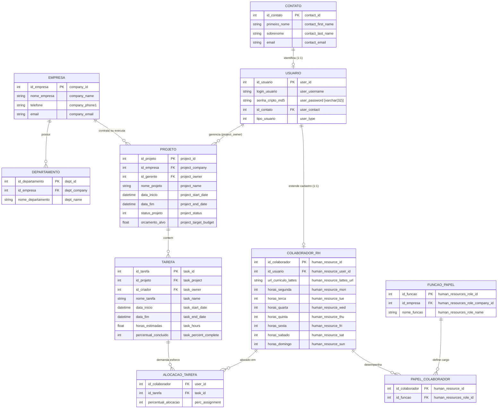
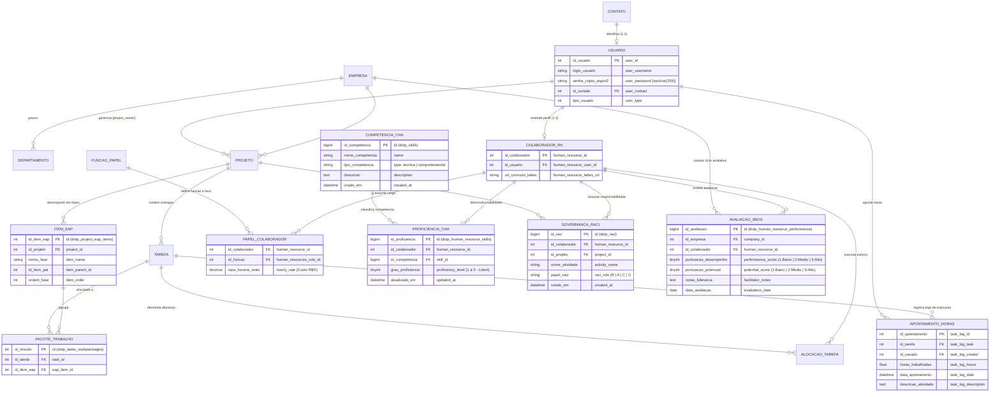

# 5. Comparativo dos Diagramas Entidade-Relacionamento (DER): dotProject+ (2018) versus dotProject# (2026)

Este documento atende diretamente aos comentários do **Prof. Dr. Rafael de Moura Speroni**:
* **Item 8:** *"Incluir o DER do doproject+ (2018) e incluir o DER da proposta (2025) para comparar no TCC."*
* **Item 9:** *"Melhorar a resolução das figuras no relatório"* (substituindo capturas rasterizadas ilegíveis por diagramas vetoriais nítidos em formato ERD/Mermaid de alta resolução).

---

## 5.1 Contextualização da Evolução do Modelo de Dados

A persistência de dados reflete diretamente a transição paradigmática entre a 6ª e a 7ª edição do Guia PMBOK. No *dotProject+* legado (UFSC/GQS, 2018), a modelagem priorizava uma visão estritamente mecanicista e prescritiva, na qual os colaboradores eram representados apenas por sua carga horária disponível em dias da semana, sem capacidade de registrar habilidades, governança de papéis ou métricas contínuas de potencial.

No *dotProject#*, a arquitetura de banco de dados foi reestruturada para suportar a governança ágil e estratégica de pessoas, incorporando novas entidades relacionais com restrições transacionais ACID gerenciadas pelo Eloquent ORM do framework Laravel 12.

---

## 5.2 Diagrama Entidade-Relacionamento (DER) do dotProject+ (2018)

O modelo relacional legado do *dotProject+* apresentava uma estrutura centrada em projetos e tarefas operacionais, com uma extensão de recursos humanos rudimentar. A Figura 4 apresenta o DER lógico do núcleo de RH e tarefas da versão legada com nomenclatura em língua portuguesa:

*Figura 4 – Diagrama Entidade-Relacionamento (DER) em Português do dotProject+ (2018). Fonte: Elaborado pelo autor (2026), baseado no esquema legado de banco de dados.*

### Diagnóstico das Limitações do DER Legado (2018):
1. **Atributos de Horas Rígidos:** A tabela `dotp_human_resource` armazenava campos fixos de segunda a domingo (`human_resource_mon` a `human_resource_sun`), tratando o colaborador meramente como uma agenda semanal de horas pré-determinadas;
2. **Inexistência de Competências:** Não havia estrutura relacional para cadastrar *hard* e *soft skills*, nem graus de proficiência técnica;
3. **Alocação Unidimensional:** A tabela `dotp_user_tasks` registrava unicamente um percentual estático (`perc_assignment`), impossibilitando distinguir se o colaborador era executor, aprovador ou consultado;
4. **Ausência de Avaliações Comportamentais:** Inexistiam tabelas para histórico de liderança, desempenho qualitativo ou plano de sucessão (Matriz 9-Box);
5. **Falta de Integridade Referencial Moderna:** As chaves estrangeiras não possuíam gatilhos de integridade cascata gerenciados por migrations versionadas.

---

## 5.3 Diagrama Entidade-Relacionamento (DER) Proposto: dotProject# (2026)

Para viabilizar as diretrizes do Guia PMBOK 7ª edição, o esquema de dados do *dotProject#* foi concebido de forma modular e expansível. A Figura 5 apresenta o DER refatorado em língua portuguesa, destacando as novas entidades introduzidas:

*Figura 5 – Diagrama Entidade-Relacionamento (DER) Expandido em Português do dotProject# (2026). Fonte: Elaborado pelo autor (2026).*

---

## 5.4 Análise Comparativa da Transformação do Esquema de Dados

O Quadro 3 detalha a evolução do esquema relacional entre as duas versões, evidenciando como a nova modelagem suporta diretamente as funcionalidades preconizadas pelo Guia PMBOK v7 e os requisitos de negócio:

##### Quadro 3 – Análise Comparativa de Entidades e Atributos: dotProject+ vs. dotProject#
| Módulo / Funcionalidade | Modelo Legado (dotProject+ 2018) | Modelo Evoluído (dotProject# 2026) | Ganho Arquitetural e Metodológico (PMBOK v7) |
| :--- | :--- | :--- | :--- |
| **Mapeamento de Competências (CHA)** | Ausente. Inexistia conceito de competência ou nível de habilidade. | Tabelas `dotp_skills` e `dotp_human_resource_skills` (relação N:M com nível de proficiência 1 a 5). | Viabiliza o modelo baseado em habilidades (*skills-based*), alimentando o Gráfico de Radar (*Skill Map*) e mitigando o *management debt*. |
| **Matriz RACI de Governança** | Ausente. Apenas alocação genérica em `dotp_user_tasks`. | Tabela `dotp_raci` cruzando `human_resource_id`, `project_id`, `activity_name` e o `enum raci_role` (R, A, C, I). | Elimina a ambiguidade de papéis, prevenindo sobreposição de esforços e formalizando a governança da equipe em tempo real. |
| **Matriz 9-Box de Desempenho** | Inexistente. Sem histórico ou categorização qualitativa. | Tabela `dotp_human_resource_performance` vinculada à empresa, com notas de 1 a 3 para desempenho e potencial. | Fornece suporte contínuo à liderança situacional, facilitando planos de capacitação, retenção de talentos e sucessão. |
| **Estrutura Analítica do Projeto (EAP)** | Tabelas com hierarquia implícita em `dotp_tasks` e imagens estáticas. | `dotp_project_wbs_items` com persistência transacional atômica e vinculação à tabela `dotp_tasks_workpackages`. | Permite a geração assistida por IA local (Llama 3.2 via Ollama) com transações seguras (rollback em falhas de parsing). |
| **Curva S Orçamentária (EVM)** | Métricas rudimentares sem correlação temporal de taxa horária. | Inclusão do campo `hourly_rate` em `dotp_human_resource_roles` e agregação dinâmica com baselines. | Possibilita o cálculo dinâmico do Custo Real (AC) versus Valor Planejado (PV) e Agregado (EV), plotados interativamente. |
| **Versionamento e Integridade** | Scripts `.sql` manuais, sem histórico de migrações e chaves frouxas. | Migrations nativas do Laravel 12 com chaves estrangeiras estritas, tipagem moderna e índices otimizados. | Garante a integridade referencial ACID, reprodutibilidade do ambiente de produção e rastreabilidade de código. |

*Fonte: Elaborado pelo autor (2026).*

A comparação dos dois modelos atesta a evolução de um banco de dados outrora projetado para o mero apontamento de horas para uma infraestrutura de dados moderna, normalizada e apta a alimentar *dashboards* analíticos e motores de inteligência artificial generativa.

---

## 5.5 Repositório de Artefatos de Engenharia e Diagramas em Alta Resolução

Para assegurar total rigor técnico e reprodutibilidade, os diagramas completos das duas bases de dados (140 tabelas no legado e 145 tabelas na versão proposta) foram extraídos diretamente dos ambientes de máquinas virtuais e compilados em formatos vetoriais e de especificação padrão:

* **Documento Técnico Unificado:** [DIAGRAMA_ENTIDADE_RELACIONAMENTO_COMPLETO.md](file:///d:/Meus%20projetos/dotproject/docs/tcc/dados_reais_vms/schemas_der/DIAGRAMA_ENTIDADE_RELACIONAMENTO_COMPLETO.md) (Contém a decomposição modular completa em Mermaid para todos os 6 módulos funcionais do sistema).
* **Especificações DBML (compatíveis com [dbdiagram.io](https://dbdiagram.io)):**
  * Base Legada (dotProject+): [der_dotproject_plus_legado.dbml](file:///d:/Meus%20projetos/dotproject/docs/tcc/dados_reais_vms/schemas_der/der_dotproject_plus_legado.dbml) (140 tabelas, 122 relacionamentos).
  * Base Proposta (dotProject#): [der_dotproject_sharp_proposto.dbml](file:///d:/Meus%20projetos/dotproject/docs/tcc/dados_reais_vms/schemas_der/der_dotproject_sharp_proposto.dbml) (145 tabelas, 128 relacionamentos).
* **Modelos PlantUML (.puml para relatórios acadêmicos):**
  * [der_dotproject_plus_legado.puml](file:///d:/Meus%20projetos/dotproject/docs/tcc/dados_reais_vms/schemas_der/der_dotproject_plus_legado.puml)
  * [der_dotproject_sharp_proposto.puml](file:///d:/Meus%20projetos/dotproject/docs/tcc/dados_reais_vms/schemas_der/der_dotproject_sharp_proposto.puml)
* **Geração de Figuras Vetoriais Nítidas:** Qualquer tabela ou subsistema pode ser visualizado e exportado em formato vetorial SVG ou imagem de alta definição no [dbdiagram.io](https://dbdiagram.io) ou Mermaid Live Editor, garantindo total legibilidade para a banca avaliadora.
