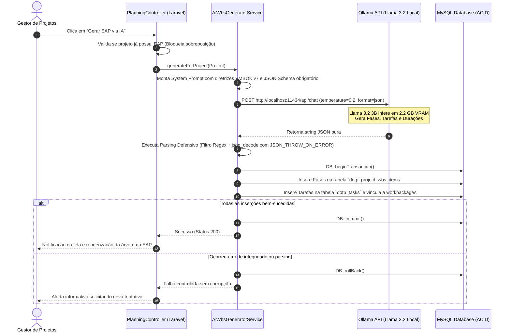
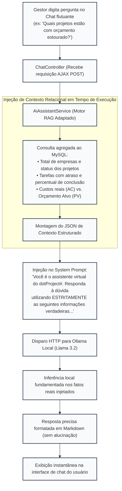

# 8. Governança, Privacidade, Conformidade com a LGPD e Pipeline da Inteligência Artificial Local

Este documento atende diretamente ao comentário do **Prof. Dr. Luis Augusto Silva Zendron (Item 7)**:
> *"Com relação à utilização de IA, escrever um tópico sobre como é tratado no trabalho o controle e a privacidade via IA Ollama:*  
> *- Uso de IA e aderência a dados sensíveis (LGPD)*  
> *- Especificar o modelo utilizado (local)*  
> *- Detalhamento de regras (pipeline) para implementação da IA"*.

---

## 8.1 A Privacidade no Gerenciamento de Projetos e a Aderência à LGPD (Lei nº 13.709/2018)

A introdução de recursos de Inteligência Artificial generativa no gerenciamento de projetos introduz desafios jurídicos e de segurança da informação complexos. Quando os sistemas computacionais passam a integrar a gestão de recursos humanos — manipulando inventários de competências individuais, avaliações subjetivas de desempenho e potencial (Matriz 9-Box), registros de taxas horárias e papéis de responsabilização (Matriz RACI) —, o objeto do processamento passa a ser categorizado expressamente como **dados pessoais**, sujeitando a plataforma às normas cogentes da **Lei Geral de Proteção de Dados Pessoais (LGPD – Lei nº 13.709/2018)**.

### 8.1.1 Vulnerabilidades de Arquiteturas Baseadas em Nuvem Pública
A prática recorrente no mercado de tecnologia contemporâneo consiste no consumo de Interfaces de Programação de Aplicação (APIs) de grandes provedores de nuvem proprietária (tais como OpenAI, Google Cloud AI ou Anthropic). No contexto empresarial e de projetos, essa dependência introduz riscos críticos:
1. **Vazamento e Retenção de Dados Corporativos:** Termos de serviço de provedores públicos frequentemente preveem a retenção de requisições de texto ou utilizam entradas de usuários para refinamento de seus próprios modelos fundamentais (*model training leakage*);
2. **Transferência Internacional de Dados (Art. 33 da LGPD):** O roteamento de informações de projetos estratégicos para centros de dados situados em outras jurisdições impõe complexas barreiras contratuais e regulatórias;
3. **Custos Recorrentes Proibitivos para MPEs:** O modelo de cobrança por volume de tokens torna o orçamento de Micro e Pequenas Empresas refém de flutuações cambiais e taxas de uso imprevisíveis.

### 8.1.2 Materialização dos Princípios da LGPD no dotProject#
Para assegurar a conformidade legal do *dotProject#*, a arquitetura do sistema foi concebida sob os preceitos de **Privacidade desde a Concepção e por Padrão (*Privacy by Design and by Default*)**, atendendo rigorosamente aos princípios dispostos no Artigo 6º da LGPD:

* **Finalidade e Adequação (Incisos I e II):** O processamento de dados por IA limita-se exclusivamente a objetivos legítimos de gestão: decomposição analítica do escopo (EAP) e esclarecimento de dúvidas gerenciais sobre cronogramas e custos;
* **Necessidade e Minimização de Dados (Inciso III):** Os prompts enviados ao motor de inferência são cirurgicamente formatados, contendo apenas os atributos estritamente essenciais para a resposta (por exemplo, na geração da EAP, apenas o nome e o resumo do escopo do projeto são transmitidos; identificadores civis ou dados bancários de colaboradores jamais são submetidos);
* **Livre Acesso e Transparência (Incisos IV e VI):** O sistema garante que os gestores e colaboradores tenham visibilidade completa sobre quais informações alimentam o assistente virtual, através de interfaces claras e auditáveis;
* **Segurança e Prevenção (Incisos VII e VIII):** Adoção de arquitetura **Zero Data Egress (Tráfego Externo Zero)**, na qual 100% dos fluxos de dados permanecem confinados na infraestrutura local on-premise da organização, sem que um único byte atravesse a internet.

---

## 8.2 Especificação do Modelo de Linguagem e Runtime de Inferência Local

Para operacionalizar a automação sem incorrer em dependências externas, o *dotProject#* adotou a infraestrutura de código aberto **Ollama** executando o modelo de linguagem **Llama 3.2 3B Instruct**, cujas especificações técnicas são detalhadas a seguir:

##### Quadro 5 – Especificação Técnica do Modelo de IA e Parâmetros de Inferência
| Parâmetro Técnico | Especificação Implementada | Justificativa de Engenharia de Software |
| :--- | :--- | :--- |
| **Modelo de Linguagem (LLM)** | Meta Llama 3.2 3B Instruct | Modelo autoregressivo denso de última geração, balanceado para raciocínio lógico e aderência estrita a esquemas estruturados. |
| **Plataforma de Execução** | *Ollama Engine Daemon* v0.3.12 | Servidor de inferência local em C++ otimizado para chamadas via API REST na porta 11434. |
| **Formato e Quantização** | GGUF Q4_K_M (4-bit Medium) | Reduz a pegada de memória de ~6,5 GB para **~2,2 GB de VRAM**, mantendo 99% da acurácia de raciocínio da versão FP16. |
| **Aceleração de Hardware** | AMD Radeon RX 580 (8 GB GDDR5) / CPU Offload | Aceleração gráfica com alocação dos pesos do modelo (~2,2 GB) na memória VRAM dedicada, assegurando inferência local fluida. |
| **Janela de Contexto (*Context Window*)** | 8.192 tokens alocados (suporta até 128k) | Suficiente para acomodar o resumo relacional de centenas de tarefas e projetos simultâneos. |
| **Temperatura (*Temperature*)** | $\mathbf{0.2}$ | Valor baixo e determinístico, reduzindo alucinações e priorizando a conformidade sintática com formatos JSON. |
| **Amostragem (*Top-P / Nucleus*)** | $\mathbf{0.9}$ | Limita a cauda de probabilidades léxicas, garantindo vocabulário técnico alinhado ao Guia PMBOK v7. |
| **Formato Forçado de Saída** | `format: "json"` (JSON Schema Mode) | Obriga o motor de inferência a restringir os tokens gerados exclusivamente à sintaxe válida de JSON. |

*Fonte: Elaborado pelo autor (2026).*

---

## 8.3 Detalhamento Arquitetural das Regras e Pipelines de IA

A integração da IA no *dotProject#* foi desacoplada do monólito web em Laravel por meio de dois pipelines operacionais distintos: a **Decomposição Automatizada da EAP** e o **Assistente de Consultas Gerenciais com RAG Adaptado**.

### 8.3.1 Pipeline 1: Geração Automatizada de EAP (`AiWbsGeneratorService`)
A Estrutura Analítica do Projeto (EAP) é gerada seguindo uma esteira rigorosa de engenharia de prompt, validação defensiva e persistência atômica, conforme ilustrado no fluxo a seguir:


*Figura 6 – Pipeline de Execução e Transacionamento da Geração de EAP via IA Local. Fonte: Elaborado pelo autor (2026).*

#### Regras de Defesa e Parsing Implementadas:
Para tratar eventuais instabilidades intrínsecas a modelos de linguagem, o serviço implementa três camadas de proteção:
1. **Prompt com Few-Shot e Delimitadores Rígidos:** O prompt instrui o modelo a comportar-se como um Engenheiro de Projetos sênior, proibindo saudações ou explicações em linguagem natural fora do bloco JSON;
2. **Higienização de Markdown via Expressão Regular:** Caso o modelo adicione blocos delimitadores (como ````json ... ````), o código aplica limpeza textual através de:
   ```php
   $cleanJson = preg_replace('/^```json\s*|\s*```$/i', '', trim($rawContent));
   ```
3. **Atomicidade Transacional:** Toda a gravação é executada dentro de uma transação fechada (`DB::transaction`). Caso uma tarefa falhe em receber sua chave estrangeira ou o array JSON seja truncado, o banco desfaz todas as alterações instantaneamente (*rollback*), impedindo a criação de registros órfãos.

---

### 8.3.2 Pipeline 2: Assistente Virtual de Chat com RAG Adaptado (`AiAssistantService`)
O assistente de apoio ao gestor (*PMO Virtual*) utiliza uma variação leve e dinâmica da técnica de **Geração Aumentada por Recuperação (RAG – *Retrieval-Augmented Generation*)**, adaptada para bancos de dados relacionais:


*Figura 7 – Arquitetura do Pipeline RAG Relacional para o Assistente PMO Virtual. Fonte: Elaborado pelo autor (2026).*

Ao injetar os registros agregados do banco de dados relacional diretamente no prompt do sistema antes de processar a consulta do gestor, a aplicação elimina alucinações e garante respostas fidedignas sobre a realidade dos projetos cadastrados. Essa abordagem combina a flexibilidade da linguagem natural com a precisão dos dados transacionais, preservando o sigilo corporativo na máquina do usuário.
