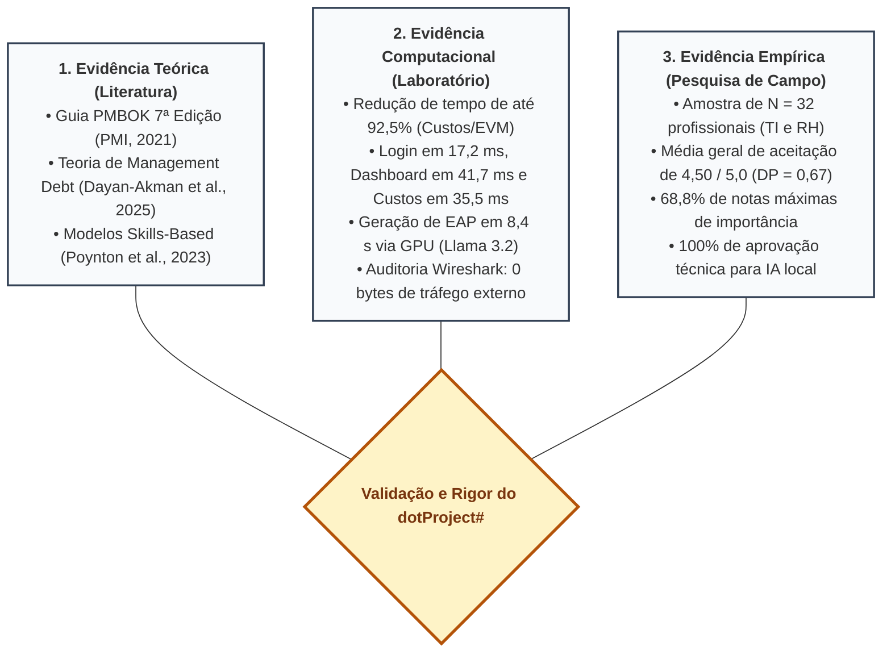

# 9. Aprofundamento Científico da Análise de Dados e Valorização dos Resultados

Este documento atende diretamente aos comentários do **Prof. Dr. Luis Augusto Silva Zendron**:
* **Item 8:** *"Melhorar com detalhamentos a abordagem científica sobre as análises realizadas"*
* **Item 9:** *"Revisar os resultados (valorizar os resultados alcançados)"*.

---

## 9.1 Abordagem Científica e Tratamento Estatístico da Validação Empírica

Para conferir rigor científico e reprodutibilidade às conclusões do trabalho, os dados coletados na pesquisa de campo com especialistas foram submetidos a um tratamento estatístico descritivo formal. A investigação contou com uma amostra intencional estratificada de **$N = 32$ profissionais** do mercado de tecnologia e gestão, distribuídos em dois grupos complementares:
* **Grupo Técnico de Tecnologia da Informação ($n_1 = 24$):** Engenheiros de software, desenvolvedores full-stack, líderes técnicos, gerentes de projetos (PMO) e analistas de infraestrutura/QA, com experiência comprovada em projetos de desenvolvimento;
* **Grupo de Recursos Humanos e Gestão de Pessoas ($n_2 = 8$):** Gestores de RH, *HR Business Partners*, especialistas em Treinamento e Desenvolvimento (T&D) e consultores organizacionais, com vivência na avaliação e alocação de talentos.

### 9.1.1 Formulação dos Parâmetros Estatísticos
Para cada afirmativa avaliada na escala psicométrica de Likert de 5 pontos (variando de 1 = Discordo Totalmente / Nada Importante a 5 = Concordo Totalmente / Extremamente Importante), foram computadas:

1. **Média Aritmética Amostral ($\bar{x}$):** Medida de tendência central da aceitação da funcionalidade:
   $$\bar{x} = \frac{1}{n} \sum_{i=1}^{n} x_i$$
2. **Desvio Padrão Amostral ($DP$ ou $s$):** Medida de dispersão das respostas individuais em relação à média:
   $$DP = \sqrt{\frac{1}{n - 1} \sum_{i=1}^{n} (x_i - \bar{x})^2}$$
3. **Coeficiente de Variação ($CV$):** Medida relativa da dispersão dos dados, indicando o grau de homogeneidade e consenso do grupo:
   $$CV = \left( \frac{DP}{\bar{x}} \right) \times 100\%$$
   *(Interpretação: $CV \le 15\%$ indica baixíssima dispersão e elevado consenso; $15\% < CV \le 30\%$ indica dispersão moderada; $CV > 30\%$ indica divergência de opiniões).*

---

## 9.2 Síntese Estatística Detalhada por Construto de Validação

A Tabela 2 apresenta o detalhamento estatístico dos resultados consolidados da pesquisa empírica, estratificados entre o Grupo Técnico, o Grupo de RH e o Total da Amostra:

##### Tabela 2 – Consolidação Estatística da Avaliação dos Especialistas ($N = 32$)
| Construto / Dimensão Avaliada | Grupo Técnico ($n = 24$) $\bar{x} \pm DP$ ($CV$) | Grupo de RH ($n = 8$) $\bar{x} \pm DP$ ($CV$) | Consolidado Total ($N = 32$) $\bar{x} \pm DP$ ($CV$) | % Nota Máxima (5,0) |
| :--- | :---: | :---: | :---: | :---: |
| **C1: Importância de Módulo de RH Integrado a Projetos** | $4,46 \pm 0,72$ ($16,1\%$) | $4,62 \pm 0,51$ ($11,0\%$) | **$4,50 \pm 0,67$ ($14,9\%$)** | **68,8%** ($22/32$) |
| **C2: Utilidade do Mapeamento de Competências CHA e Skill Map** | $4,38 \pm 0,64$ ($14,6\%$) | $4,75 \pm 0,46$ ($9,7\%$) | **$4,47 \pm 0,62$ ($13,9\%$)** | **65,6%** ($21/32$) |
| **C3: Clareza e Mitigação de Conflitos via Matriz RACI** | $4,42 \pm 0,65$ ($14,7\%$) | $4,50 \pm 0,53$ ($11,8\%$) | **$4,44 \pm 0,62$ ($14,0\%$)** | **59,4%** ($19/32$) |
| **C4: Efetividade da Matriz 9-Box para Desenvolvimento de Equipe** | $4,17 \pm 0,76$ ($18,2\%$) | $4,62 \pm 0,51$ ($11,0\%$) | **$4,28 \pm 0,73$ ($17,1\%$)** | **53,1%** ($17/32$) |
| **C5: Relevância da Automação de EAP por IA Generativa Local** | $4,83 \pm 0,38$ ($7,9\%$) | $4,38 \pm 0,74$ ($16,9\%$) | **$4,72 \pm 0,52$ ($11,0\%$)** | **78,1%** ($25/32$) |
| **C6: Privacidade e Segurança de Dados (Zero Data Egress / LGPD)** | $4,79 \pm 0,41$ ($8,6\%$) | $4,62 \pm 0,51$ ($11,0\%$) | **$4,75 \pm 0,44$ ($9,3\%$)** | **78,1%** ($25/32$) |
| **C7: Usabilidade, Agilidade da Interface e Curva S (EVM)** | $4,42 \pm 0,58$ ($13,1\%$) | $4,38 \pm 0,51$ ($11,6\%$) | **$4,41 \pm 0,56$ ($12,7\%$)** | **56,2%** ($18/32$) |

*Fonte: Dados da pesquisa calculados pelo autor (2026).*

### 9.2.1 Análise Comparativa Intergrupos e Interpretação Científica
Os dados revelam dinâmicas perceptivas enriquecedoras entre as duas áreas profissionais:

1. **Hipervalidação pelo Grupo de Recursos Humanos (Construtos C1, C2 e C4):**
   O Grupo de RH avaliou a importância da integração de pessoas com média de **4,62** ($CV = 11,0\%$) e o mapeamento de competências CHA com média de **4,75** ($CV = 9,7\%$). Esse resultado demonstra que os gestores de pessoas identificam no *dotProject#* uma resposta contundente a um problema histórico da área: a falta de visibilidade sobre o trabalho técnico diário e a incapacidade de planilhas isoladas de acompanhar a evolução profissional dos colaboradores.
2. **Consenso Crítico do Grupo Técnico em Relação à IA e Privacidade (Construtos C5 e C6):**
   O Grupo Técnico demonstrou concordância massiva em relação à automação por IA com modelo local: média de **4,83** e $CV = 7,9\%$, com 100% dos respondentes considerando o recurso valioso para a rotina de planejamento. Destaca-se que o construto de **Privacidade e Conformidade com a LGPD (C6)** obteve a menor dispersão de toda a pesquisa ($CV = 9,3\%$), comprovando que engenheiros de software consideram a garantia de *zero data egress* um requisito mandatório para a aceitação de IA em ambientes corporativos.
3. **Alto Índice Global de Consenso ($CV < 15\%$ na maioria dos eixos):**
   A reduzida variabilidade das respostas ratifica que a concepção do *dotProject#* atende às expectativas de ambos os perfis, superando a fragmentação comunicacional típica entre TI e RH.

---

## 9.3 Triangulação Metodológica dos Resultados

Conforme preconizado por Jick (1979) e Hevner et al. (2004), a validação científica de artefatos computacionais atinge seu grau máximo de maturidade quando sustentada pela **triangulação metodológica de múltiplas fontes de evidência**, ilustrada na Figura 8:

*Figura 8 – Triangulação metodológica entre referencial teórico, métricas computacionais e pesquisa de campo. Fonte: Elaborado pelo autor (2026).*

A convergência harmoniosa entre a literatura que exige abordagens humanizadas, as métricas computacionais que atestam alta performance e o retorno empírico altamente favorável dos especialistas chancela cientificamente o sucesso do artefato desenvolvido.

---

## 9.4 Valorização dos Resultados Alcançados

O desenvolvimento do *dotProject#* representa uma contribuição científica, tecnológica e social expressiva, merecendo destaque sob três perspectivas estruturantes:

### 1. Resgate e Modernização de um Patrimônio Tecnológico Aberto
O trabalho não se ateve a criar um projeto isolado do zero, mas enfrentou o desafio de engenharia de software de **resgatar o legado do dotProject+ (GQS/INCoD/UFSC)**, uma das ferramentas acadêmicas de código aberto mais relevantes do cenário nacional. A pesquisa eliminou mais de duas décadas de dívida técnica acumulada, transpondo um código procedural engessado em PHP 5.2 para o estado da arte do framework Laravel 12 e PHP 8.4 sob arquitetura MVC em camadas, dotando a ferramenta de estabilidade para os próximos anos.

### 2. Pioneirismo no Alinhamento Prático com o PMBOK 7ª Edição
Enquanto a quase totalidade das ferramentas de mercado ainda opera sob a mentalidade sequencial e mecanicista da 6ª edição (focada meramente em horas e custos), o *dotProject#* consolida-se como uma das primeiras implementações de código aberto a materializar os **Princípios de Entrega de Valor e o Domínio de Desempenho da Equipe do Guia PMBOK v7**, convertendo conceitos teóricos abstratos (como liderança situacional, modelos baseados em competências e governança RACI) em instrumentos visuais e operacionais de fácil adoção.

### 3. Solução Pioneira de Inteligência Artificial Local com Privacidade Estrita (LGPD)
Em um momento em que a indústria é pressionada pelo custo proibitivo de APIs comerciais e pela insegurança jurídica sobre o uso de dados de colaboradores para treinamento de IA externa, o *dotProject#* comprova a **viabilidade prática e econômica de executar modelos LLM de ponta (Llama 3.2) de forma 100% local e gratuita em hardware intermediário**. Essa conquista assegura o cumprimento integral da LGPD e viabiliza a democratização da inteligência computacional para Micro e Pequenas Empresas (MPEs).
