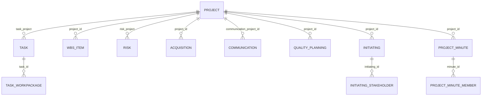

# Data Model: Cascading Project Delete

The following schema diagram represents the database entities that will be cleaned up on project deletion.

## Cascading Rules

1. **Delete tasks and pivots**:
   - For all tasks where `task_project = project_id`, retrieve task IDs.
   - Delete pivot table records in `dotp_tasks_workpackages` matching these task IDs.
   - Delete task records in `dotp_tasks`.
2. **Delete WBS items**:
   - Delete all `dotp_project_wbs_items` where `project_id = project_id`.
3. **Delete risks**:
   - Delete all `dotp_risks` where `risk_project = project_id`.
4. **Delete acquisitions**:
   - Delete all `dotp_acquisitions` where `project_id = project_id`.
5. **Delete communications**:
   - Delete all `dotp_communications` where `communication_project_id = project_id`.
6. **Delete quality plannings**:
   - Delete all `dotp_quality_plannings` where `project_id = project_id`.
7. **Delete initiating and stakeholders**:
   - Find `dotp_initiating` where `project_id = project_id`.
   - Delete all `dotp_initiating_stakeholders` where `initiating_id` matches.
   - Delete `dotp_initiating` records.
8. **Delete project minutes and members**:
   - Find all `dotp_project_minutes` where `project_id = project_id`.
   - Delete pivot records in `dotp_project_minute_members` matching these minute IDs.
   - Delete `dotp_project_minutes` records.
